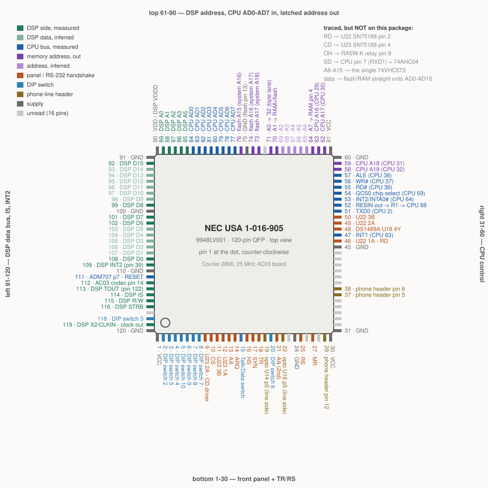
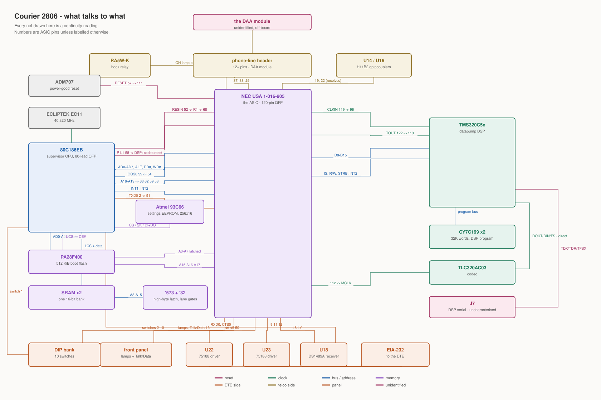

# Pinning out the NEC ASIC

[board-parts.md](board-parts.md) identifies the ASIC only by its marking -
`NEC USA 1-016-905 9948LV001`, a USR part number on an NEC-fabricated gate
array, week 48 of 1999. That is as far as the marking goes: `1-016-905` is
USR's number, `LV001` is NEC's lot code, and the metal is custom. There is no
catalogue part and no datasheet to find. A 120-pin plastic QFP is the usual
body for an NEC customer gate array of that era (the µPD65xxx-family masters),
but the package says nothing about what is inside it.

So the part has to be identified by what it is wired to. This file records
that, from the owner's continuity readings.

> **These readings are from the 25 MHz Courier 2806** - the AC03 board,
> supervisor 7.3.14 / DSP 3.0.13, the unit dumped in
> `artifacts/courier-2806-25mhz-flash-20260912`. Confirmed by the owner.
>
> The marking above is **not** from that board. It was read off a photo of the
> **20.16 MHz** unit, the one running ID_SDL 4.03d that
> [asic-port-map.md](asic-port-map.md) probed through the monitor. **The
> 2806's ASIC has not been read for a marking at all**, and until it is,
> nothing establishes that the two boards carry the same gate array. Reading
> the text off this one is the cheapest outstanding item in the file.
>
> What does transfer, and what does not, is worked out below.

## Which findings cross between the two boards

The two boards are not interchangeable and the distinction matters per pin, so
it is worth settling before the map rather than after.

**The DSP side transfers.** [board-parts.md](board-parts.md) establishes that
stock 7.3.14 runs on both the 20.16 MHz AC01 board and this 25 MHz AC03 board,
and that its **DSP payload is byte-identical between them** - 126,851
consecutive identical bytes covering the payload and all three overlays. Code
that identical cannot be talking to two different interfaces. So `IS`, `INT2`,
`READY` and the data bus are findings about both boards, not just this one.

**The CPU side does not.** The same comparison finds the whole difference
between those two images **is** in the supervisor. A differing supervisor is
exactly where a differing CPU-side wiring would show up, so `ALE`, `RD#`,
`WR#`, the two interrupt lines and the unconnected `INT0` are findings about
the 2806 and are not evidence about the 20.16 MHz board.

That split is what the sections below are graded against.

## Orientation and pin numbering

The package is 120 pins, 30 a side, with the index dot at the **bottom left**.

"Bottom left" is **in the part's own frame, not the board's**: the readings
were taken viewed from above with the `NEC USA 1-016-905` markings upright, and
"top", "right" and "left" below mean the edges of the chip in that position.
That is the orientation to reproduce before re-checking any of this - it does
not depend on how the ASIC happens to sit relative to the board's silkscreen,
and it is the frame a package drawing would use.

It also fixes which of the two common QFP drawing styles applies. Both number
counter-clockwise from a top view; they differ in where pin 1 sits. Pin 1 at
the top-left runs `1`-`30` down the left side. Pin 1 at the **bottom** left -
which is what the dot shows in the part's own frame - runs `1`-`30` along the
bottom. So, under the JEDEC convention of pin 1 at the dot and numbering
counter-clockwise viewed from above - **confirmed by the owner**:

| pins | edge | direction |
|---|---|---|
| `1`-`30` | bottom | left to right |
| `31`-`60` | right | bottom to top |
| `61`-`90` | top | right to left |
| `91`-`120` | left | top to bottom |

The readings below were taken in per-side local numbering. The translation is:

* **top edge**, counted left to right: pin = `91 - N`
* **right edge**, counted top to bottom: pin = `61 - N`
* **left edge**, counted bottom to top: pin = `121 - N`

**The direction is confirmed: `1`-`30` is the bottom edge.** Stated by the
owner, who took the readings and therefore owns the frame they were recorded
in. That retires the clockwise alternative, which would have numbered the same
dot `1`-`30` up the *left* side, putting the address bus at `31`-`36` instead
of `85`-`90` and `IS` at `7` instead of `114`. Everything below is in the
counter-clockwise scheme and needs no second reading.

The bottom-edge readings agree with it independently, which is worth keeping
because it is a check rather than an assertion. `10`-`27` land on the one edge
that was unread, and the edge the panel was predicted to be on. Read clockwise
they would land on pins already read as the DSP data bus - `13`, `14`, `16`,
`17` and `18` would be `D5`, `D4`, `D2`, `D1` and `D0`, with `18` a *measured*
pin, not an inferred one. Five collisions with a bus against a clean fit on the
free edge is the same answer the owner gives, arrived at from readings taken
months apart.

What no measurement settled, and what the confirmation is therefore doing, is
worth being precise about. The supply pin does not settle it: the top-left pin
is tied to DSP pin 15, which SPRU056D's Table A-4 for the PQ package gives as
`VDDD` - one of four digital-core supply pins at 14, 15, 32 and 33, in adjacent
pairs, with `IS` at 90 in the same table, so the package is confirmed as the
132-pin BQFP the part marking implies. But that pin is physically at a *corner*,
and a corner is where a gate-array library puts a supply pad under either
convention. What it confirms is the 30-a-side count and that the top edge
starts at a corner, not the direction. Nor could a meter have decided it:
counter-clockwise and clockwise number the same physical pins in the same
frame. The frame is the owner's, and **the edge and the count from the corner
remain the durable record** - if a numbering question ever reopens, that is
what to check against.

Every bare pin number in the table below is an **ASIC** pin. DSP and CPU pins
are named as such - they collide otherwise.



That picture is generated from `tools/draw_asic_pinout.py`, which holds the map
as data. It is drawn rather than parsed from this file, so when a reading lands
or is corrected, edit the table here **and** `PINS` there, then re-run the tool.

**There is a second picture for the other question.** The pin tables answer
"what is on ASIC pin N"; they cannot answer "what talks to what", because each
of them only sees one package. [board-map.svg](board-map.svg) draws the parts
and the nets between them, from `tools/draw_board_map.py` and on the same terms
- the map is data in the tool, every net on it is a continuity reading, and it
is kept current the same way.



## What is connected

Measured pins are marked; the rest of a bus run is **inferred** from the
measured ends being contiguous and in order, and is marked so.

### Top edge

| local | pin | signal |
|---|---|---|
| 1 | 90 | `VDD`, shared with DSP pin 15 (`VDDD`) |
| 2-5 | 89-86 | DSP `A0` `A1` `A2` `A3` |
| 6 | 85 | DSP `A5` - `A4` is **not connected** |
| 7-14 | 84-77 | CPU `AD0`-`AD7` |
| 16 | 75 | flash pin 12, `CE#` - **the ASIC selects the flash** |
| 17 | 74 | flash pin 34 (`A16`, system `A17`) - **the conflict resolved**, see below |
| 18 | 73 | flash pin 3 (`A17`, system `A18`) |
| 15 | 76 | flash pin 35, `A15` (system `A16`) |
| 20 | 71 | latched `A0` **out** - 74VHC32 pin 12 (`4A`), the low byte lane's term in `U12`'s `WE#` |
| 21 | 70 | latched `A1` **out** - RAM pin 10 and flash pin 11, which are those parts' own `A0` |
| 22-26 | 69-65 | latched `A2`-`A6` **out** *(inferred)* |
| 27 | 64 | latched `A7` **out** - RAM pin 4, which is that part's `A6` |
| 28 | 63 | CPU `A16` **in** - CPU pin 29; **not `AD15`**, see below |
| 29 | 62 | CPU `A17` **in** - CPU pin 30 |
| 30 | 61 | `VCC` |

Only locals 15-16 (`76`-`75`) and 18-19 (`73`-`72`) are unread on this edge.
This edge is the address side of the part: see below.

> **One row was renumbered.** The flash address pin was read with the top edge
> miscounted from 60 rather than 61, so it is `74`, not the `73` first reported.
> The owner confirms the miscount was confined to that reading: pins `71` and
> `70` stand as given.

### Right edge - the CPU control group

| local | pin | signal | CPU pin |
|---|---|---|---|
| 1 | 60 | `GND` | - |
| 3 | 58 | `A19` **in** | 32 |
| 4 | 57 | `ALE` | 38 |
| 5 | 56 | `WR#` | 37 |
| 6 | 55 | `RD#` | 36 |
| 7 | 54 | *unread* | - |
| 8 | 53 | `INT2`/`INTA0#` | 64 |
| 9 | 52 | `RESIN` **out** - through `R1`, 1k | 68 |
| 10 | 51 | `TXD0` **in** - serial channel 0's transmit | 2 |
| 11 | 50 | `U22` pin 10 (`3B`) | - |
| 12 | 49 | `U22` pin 4 (`2A`) | - |
| 13 | 48 | `U18` pin 11 | - |
| 14 | 47 | `INT1` | 63 |
| 15 | 46 | `U22` pin 2 (`1A`) - **the `RD` net** | - |
| 16 | 45 | `GND` | - |
| 23 | 38 | phone-line header pin 6 | - |
| 24 | 37 | phone-line header pin 5 | - |
| 30 | 31 | `GND` | - |

`ALE`, `WR#` and `RD#` land adjacent, which makes this edge the CPU-side bus
control group and gives **pin 54 as the prime suspect for the chip select**
that decodes the `0x00`-`0x7f` I/O window. That window's top at `0x7f` is a
decode somebody chose, and its pin has to be somewhere; one pin between `RD#`
and the first interrupt is where it would sit.

CPU `INT0` (CPU pin 62) is **not connected**.

**`A19` closes the high address run, and it wraps the corner.** Pin `58` is CPU
pin 32, `A19`. With `62` as `A17` (CPU 30) and `59` as `A18` (CPU 31), three
consecutive CPU address lines land on `62`, `59` and `58` - consecutive ASIC
pins **but for the corner pair `61`/`60`, which are the supplies**. A layout
that runs a bus straight through and steps over the corner pads is the ordinary
thing to see, and it is a check on two separate claims at once: the
counter-clockwise numbering that puts `62` and `59` two pins apart, and the
pad-ring convention that says why.

CPU `INT1` is **CPU pin 63**, which this table had left blank. That matters
beyond bookkeeping - see [the `SD` reading](#readings-recorded-but-not-yet-interpreted),
where CPU pin 63 is also recorded as carrying `SD`. Two signals cannot share
it, and `INT1` is now read from both ends.

**The lower half of this edge is not CPU at all.** `37` and `38` go to the
**phone-line header**, pins 5 and 6. The CPU control group sits at locals 4-14;
these are at 23 and 24, well down the edge, with eight unread pins between. So
the right edge is two groups, not one, and the second is the telco side.

> **Three groups, as it turned out.** `45`-`51` have since been read and they
> are the **EIA-232 side** - three of `U22`'s driver inputs, an unidentified
> `U18`, and the CPU's `TXD0`. So this edge runs CPU bus control at the top,
> the DTE interface in the middle, and the telco at the bottom. See
> [the DTE interface](#the-dte-interface-is-on-this-edge-and-rd-comes-out-of-the-asic).

That is the first pin on this package to reach the line interface, and it does
not arrive without a firmware counterpart waiting for it. Two line signals are
already attributed to ASIC ports and neither had any physical evidence:

* **Ring sense**, port `0x14` bit `1`. [daa-line-interface-2016mhz.md](daa-line-interface-2016mhz.md)
  has the cadence machine sampling it directly from a 5 ms ticker - `in al,
  0x14` / `test al, 2` at `0x1501d` - so this is an **input** the ASIC latches
  for the CPU to poll.
* **The hook relay**, port `0x10` bit `0`, which [dsp-rom-probe.md](dsp-rom-probe.md)
  records as clicking with the `OH` lamp. An **output**.

An input and an output, both line-side, both in this part's ports, and now two
line-side pins on the package. The obvious pairing is that these are those two,
but **nothing here establishes which pin is which, or that the pairing is right
at all** - a header carries whatever the board put on it.

> **And the pairing has since got worse, not better.** Two optocouplers are now
> found on ASIC pins `19` and `22`, so there are four line-side pins, not two,
> and ring sense has a better home than a header pin - crossing the isolation
> barrier is what an opto is for. See
> [the isolation barrier](#the-isolation-barrier-is-found-and-the-asic-is-on-the-receiving-side).

**What to read next is the header itself.** Its pinout is unknown and it is
cheap: pins 1-6 against ground, the relay coil, and the `RA5W-K`. Two specific
checks would settle the pairing - continuity from ASIC `37` or `38` to the
relay's coil terminals names the hook output, and whichever of the two changes
state when the line rings is the ring sense.

**One thing the header is probably not is bare tip and ring.** A digital gate
array cannot sit on a telephone line; there has to be a transformer or an opto
between, and the header is far likelier to be a **DAA module interface carrying
logic-level signals** than the line itself. **The optos predicted here have
since been found** - `U14` and `U16`, on pins `19` and `22`. [board-parts.md](board-parts.md)
says outright that "the DAA/line section is" outside the photograph it was
compiled from, so that module is unidentified, and identifying it is the same
outstanding item as the EIA-232 receiver - a part everyone knows is there that
nobody has looked at.

### Left edge - the DSP data bus and its strobes

| local (from top) | pin | signal |
|---|---|---|
| 2 | 92 | DSP `D15` |
| 3-8 | 93-98 | DSP `D14`-`D9` *(inferred)* |
| 9 | 99 | DSP `D8` |
| 10 | 100 | `GND` - **the bus-splitting pin, and it is a ground** |
| 11 | 101 | DSP `D7` |
| 12 | 102 | DSP `D6` |
| 13-17 | 103-107 | DSP `D5`-`D1` *(inferred)* |
| 18 | 108 | DSP `D0` |
| 19 | 109 | DSP `INT2` (pin 39) |
| 20 | 110 | `GND` |
| 21 | 111 | `ADM707` pin 7 - the supervisor's `RESET` |
| 22 | 112 | `AC03` codec pin 14 - the ASIC's **only** line to the codec |
| 23 | 113 | DSP `TOUT` (pin 122) - the DSP's timer output |
| 24 | 114 | DSP `IS` |
| 25 | 115 | DSP `R/W` (pin 92) |
| 26 | 116 | DSP `STRB` (pin 93) |
| 28 | 118 | **DIP switch 3** - previously read as a supply; see [below](#switch-3-is-on-pin-118-and-it-was-the-supply-reading-that-was-the-artifact) |
| 29 | 119 | DSP `X2/CLKIN` (pin 96) - **the ASIC clocks the DSP** |
| 30 | 120 | `GND` |

Local 1 is **pin 91**, and it is `GND` - the other flank of the top-left
corner.

The five measured data pins fall in two exact descending runs - `99`-`92` for
`D8`-`D15` and `101`-`108` for `D7`-`D0` - so the twelve unread ones between
them are inferred, not read. **Pin 100 sits between the two groups** and is not
part of either; a ground or supply splitting the bus halves was the obvious
candidate.

**It is a ground.** That was a prediction made from the shape of the bus alone -
two descending runs with one pin between them - and probing it returned the
predicted answer. It is a small thing, but it is the pad-ring convention
predicting a specific pin rather than being invoked after the fact, and the
twelve inferred data lines either side of it are the thing that convention is
holding up.

Pin `117` is the only unread one left - one of the thirty.

#### The ASIC is in the flash's high address path

Pin 73 goes to the flash's `A17` - its pin 3, confirmed since, and see
[the flash pin conflict](#the-flash-pin-conflict-was-two-pins-all-along) for
what that did to the neighbouring reading. It is not a line the CPU should need
help with. The part is a **PA28F400**, 4 Mbit, and the 2806 dump
(`artifacts/courier-2806-25mhz-flash-20260912/courier-board.rom`) is 524,288
bytes - the whole device, with no second bank hiding behind it. So `A17` here
is the part's own top address line, not a page select onto more silicon.

Which leaves the question of why it comes out of the ASIC at all. An 80186 has
a 20-bit address and 512 KiB of flash needs `A0`-`A18` of it; nothing about
that requires an intermediary. Two readings fit:

* **The ASIC buffers or remaps the high flash addresses.** The CPU's upper
  address lines are not multiplexed onto `AD0`-`AD7` and have to reach the
  flash somehow, and if one of them is routed through the ASIC the rest
  probably are too.
* **`A17` is switchable**, splitting the part into two 256 KiB halves the ASIC
  selects between. The dump does not rule this out - a full-device read through
  the monitor would see both halves either way - but nothing in the firmware
  analysis has ever needed a flash bank, so this is the weaker of the two.

Either way it makes a prediction, and a cheap one. **`72`-`61` and `76`-`74`
are the unread rest of this edge**, immediately adjacent, and if the high flash
addresses come through this part then `A16` and `A18` are in there. Three or
four continuity readings settle which of the two readings above is right, and
they are the highest-value pins left on the package - a CPU-to-flash path
running through the ASIC is a structural fact about the memory map that nothing
here has modelled.

#### The CPU is an 80C186EB in the 80-lead QFP, and now the pin numbers check

`'573` pin 9 goes to **CPU pin 11**, and that reading is worth more than the
latch question it was asked to settle. Every CPU pin number in this file can
now be checked against a datasheet instead of taken on trust.

Intel's `80C186EB/80C188EB` datasheet, Table 7, gives the 80-lead QFP package
locations. Against the readings recorded here:

| CPU pin | this file says | datasheet Table 7 | |
|---|---|---|---|
| 36 | `RD#` | `RD` | ok |
| 37 | `WR#` | `WR` | ok |
| 38 | `ALE` | `ALE` | ok |
| 62 | `INT0`, unconnected | `INT0` | ok |
| 64 | `INT2`/`INTA0#` | `INT2/INTA0` | ok |
| 11 | *(this reading)* | `AD8 (A8)` | - |
| 75 | `INT3` | `T0OUT` | **no** |

Five exact matches is not a coincidence, and it settles two things at once.
**The part is an 80C186EB**, not the plain `S80C186` that
[board-parts.md](board-parts.md) records from the marking - the XL's QFP puts
`ALE` on pin 10 and `INT0` on 31, which these readings are nothing like. And
the **package is the 80-lead QFP**, which is why pin numbers above 68 appear at
all. Everything the harness does with `EbSerial` is on the right device.

The one miss is `INT3`. It is on QFP **65**, not 75; 75 is `T0OUT`. That
reading should be retaken - it is a loose end in the interrupt map, and now it
is a loose end with a predicted answer.

#### Table 7 in full, so nobody has to fetch it again

The table was being consulted and not carried. Every CPU pin number in this
file is checkable against it without leaving the repository:

| pin | name | pin | name | pin | name | pin | name |
|---|---|---|---|---|---|---|---|
| 1 | `CTS0` | 21 | `AD4` | 41 | `S1` | 61 | `UCS` |
| 2 | `TXD0` | 22 | `AD12` | 42 | `S0` | 62 | `INT0` |
| 3 | `RXD0` | 23 | `AD5` | 43 | `DEN` | 63 | `INT1` |
| 4 | `P2.5/BCLK0` | 24 | `AD13` | 44 | `HLDA` | 64 | `INT2/INTA0` |
| 5 | `P2.3/SINT1` | 25 | `AD6` | 45 | `HOLD` | 65 | `INT3/INTA1` |
| 6 | `P2.4/CTS1` | 26 | `AD14` | 46 | `TEST` | 66 | `INT4` |
| 7 | `P2.0/RXD1` | 27 | `AD7` | 47 | `LOCK` | 67 | `PDTMR` |
| 8 | `P2.1/TXD1` | 28 | `AD15` | 48 | `NMI` | 68 | **`RESIN`** |
| 9 | `P2.2/BCLK1` | 29 | `A16` | 49 | `READY` | 69 | **`RESOUT`** |
| 10 | `AD0` | 30 | `A17` | 50 | `P1.7/GCS7` | 70 | `OSCOUT` |
| 11 | `AD8` | 31 | `A18` | 51 | `P1.6/GCS6` | 71 | `CLKIN` |
| 12 | `VSS` | 32 | `A19/ONCE` | 52 | `P1.5/GCS5` | 72 | `VCC` |
| 13 | `VCC` | 33 | `VSS` | 53 | `VSS` | 73 | `VSS` |
| 14 | `VSS` | 34 | `VCC` | 54 | `VCC` | 74 | `CLKOUT` |
| 15 | `AD1` | 35 | `VSS` | 55 | `P1.4/GCS4` | 75 | `T0OUT` |
| 16 | `AD9` | 36 | `RD` | 56 | `P1.3/GCS3` | 76 | `T0IN` |
| 17 | `AD2` | 37 | `WR` | 57 | `P1.2/GCS2` | 77 | `T1OUT` |
| 18 | `AD10` | 38 | `ALE` | 58 | `P1.1/GCS1` | 78 | `T1IN` |
| 19 | `AD3` | 39 | `BHE/RFSH` | 59 | `P1.0/GCS0` | 79 | `P2.7` |
| 20 | `AD11` | 40 | `S2` | 60 | `LCS` | 80 | `P2.6` |

Source: Intel `80C186EB/80C188EB, 80L186EB/80L188EB` datasheet, Table 7, "QFP
Package Location with Pin Names". Names in the 188EB's parentheses are dropped.

**Every CPU pin this file records now checks out against it**, `INT3` above
excepted - including the ones read since the table was first consulted: `2` as
`TXD0`, `28` as `AD15`, `29` as `A16`, `58` as `P1.1/GCS1` (the DSP's reset,
which the harness's `0xff56` bit 1 predicted before anyone probed it), `60`/`61`
as `LCS`/`UCS`, and `63` as `INT1` - the reading that decided the `SD` group
conflict.

**And it answers the reset question directly: `RESIN` is CPU pin 68**, with
`RESOUT` next door on 69.

#### There is one '573, and it latches the high byte

`'573` pin 9 is `D7`, and CPU pin 11 is `AD8`. So `AD8` is on this latch's
input side, which is the **second** reading to say so - the earlier one said
only "the other side goes to `AD8`" without naming a pin. Two readings agreeing
on the one signal that decides it: **this '573 latches the high byte**,
`AD8`-`AD15` into `A8`-`A15`.

And there is **only one '573 on the board**, with a **74VHC32** beside it. That
was the other half of the question and it closes off the easy answer. The
previous revision proposed two latches, one per byte, with the readings taken
across both without distinguishing them. There is no second latch to distribute
them to.

#### The ASIC latches `A0`-`A7`, and pin 70 is the proof

An 80C186EB multiplexes `AD0`-`AD15` and drives `A16`-`A19` separately. The
'573 accounts for the high byte. **Nothing else identified on the board latches
the low byte**, and the memories need it - flash and SRAM both take `A0`-`A7`
as ordinary address inputs and neither has any idea what `ALE` is.

**ASIC pin 70 goes to RAM pin 10 and flash pin 11. Both are `A0`.** That is the
low byte's first bit, driven out of this part into both memories, and it settles
what a previous revision could only propose:

* the ASIC is the **low-byte address latch** for the memory bus,
* which is what `AD0`-`AD7` on pins `84`-`77` and `ALE` on pin `57` are *for* -
  not merely self-decoding its own `0x00`-`0x7f` window, which is all this file
  had ever used `ALE` to explain,
* and the '573 beside it is the high-byte half of one shared job.

The memory address bus therefore comes from three places at once: `A0`-`A7`
from the ASIC, `A8`-`A15` from the '573, `A16`-`A19` from the CPU - except
`A17`, which is also the ASIC, on pin 74.

**The outputs are on the top edge, not where the last revision guessed.** It
predicted the unread `28`-`46` run at the bottom right; `A0` is at 71, `A1` at 70 and the flash's high
address bit at 74, both on the top edge, in the run this file had already flagged as
the neighbours of the `A17` pin. So the top edge is the address side of the
package end to end: `AD0`-`AD7` in at locals 7-14, latched address out at
locals 18 and 21, with locals 15-17, 19-20 and 22-30 still unread between and
around them.

That is thirteen unread pins on one edge for the seven remaining low-address
bits, and it is now the cheapest high-value trace on the part - `A1` is RAM pin
9 and flash pin 10, and they walk down from there. If `A1`-`A7` are in that run
the low-byte latch is fully mapped, and whatever is left over on that edge is
the next question.

**The high flash address line is the odd one out and stays odd.** The CPU's
high address lines are non-multiplexed outputs that need no latch, so there is
no bus reason for one of them to come out of the ASIC. Routing it through a part
that also holds a latch is what **remapping** looks like, not buffering. Which
bit it is has been read two ways - see the conflict noted below, along with the
one-bit shift that makes every flash address label one less than the system
address it carries.

#### The two SRAMs are a 16-bit pair, and the ASIC supplies the byte lane

Two more readings finish the memory decode, and they deflate the claim the
previous revision made from a partial view of it.

| reading | |
|---|---|
| '32 pin 12 (`4A`, in) | ASIC pin 71 |
| '32 pin 13 (`4B`, in) | flash pin 43, `WE#` - the board write strobe |
| '32 pin 11 (`4Y`, out) | SRAM `U12` pin 27, `WE#` |
| '32 pin 8 (`3Y`, out) | SRAM `U4` pin 27, `WE#` |
| both SRAMs' `CE#` | **CPU pin 60, `LCS`** |

**The CPU does its own chip select.** `LCS` reaches both SRAMs directly, so the
ASIC is not decoding the RAM, and the previous revision's stronger reading -
that the ASIC owns the SRAM's decode - is excluded outright. That was the probe
this file asked for and it came back against the claim.

> **`UCS` is also on a RAM.** CPU `UCS` (pin 61) goes to **RAM pin 20**, which
> on a 32Kx8 part is `CE#`. Neither of the CPU's dedicated memory selects is on
> the flash - the ASIC holds the flash's `CE#`.
>
> **The pair is one bank.** The two SRAMs have their `CE#` pins connected
> together and their `OE#` pins connected together; only the write enables are
> separate, made by the `'32` from the byte-lane terms. Selected together, read
> together, written a byte at a time - which is exactly the 16-bit bank this
> section's next paragraph argues for, now confirmed at the pins rather than
> inferred from the part sizes.
>
> **But the select's identity is in conflict.** With one common `CE#` net, the
> earlier reading (`LCS`, CPU pin 60) and the later one (`UCS`, CPU pin 61)
> cannot both be right - two chip-select outputs cannot drive one net. CPU 60
> and 61 are **adjacent pins**, and this file has now found three off-by-one
> transcriptions on other nets, so that is the likely explanation rather than
> anything subtle.
>
> **The check is one probe done twice**: RAM pin 20 against CPU 60, then against
> CPU 61. Exactly one should answer. It matters because the 80186's `LCS` covers
> low memory from address zero and `UCS` covers the top of the space - RAM on
> `LCS` is the conventional arrangement, RAM on `UCS` is not, and the firmware's
> own memory map follows from which it is.

**Both SRAMs share one select and have separate write enables, which says what
they are.** Two 32Kx8 parts enabled together, on a CPU with a 16-bit data bus,
are not two banks: they are the **low and high byte lanes of one 32K x 16
memory**. Steering a byte write to one lane or the other is then done exactly
the way this board does it - a `WE#` per lane, each `OR`ed from the common
write strobe and a lane term. That is what gate 4 and gate 3 are, one lane each.

So ASIC pin 71 is the **low lane's term**, and on any 16-bit 80186 design that
term is `A0`. The ASIC latches `A0`-`A7`; `A0` is the bit that never reaches a
memory's address pins in a 16-bit system, because it selects the lane instead.
Which is why pin 70, the other address output found so far, lands on the
memories' own `A0` pins - **that is system `A1`**, and the whole latched address
is shifted by one at the parts.

**The veto reading is withdrawn.** The previous revision had the ASIC holding a
term of the SRAM's write enable and concluded it could stop a CPU write and that
firmware could not route around it. The gate is real and the term is real, but
the term is an address bit doing byte steering, not a permission. Nothing is
being gated in the sense that claim meant. The ASIC's role here is the one
already established - it is the low-byte address latch - and this is that same
job seen from the memory's side.

This is also the arrangement [board-parts.md](board-parts.md) already records
on the other side of the board, where the DSP's `CY7C199` pair is described as
"2 x 32Kx8, 64 KB = 32K words on a 16-bit bus". The CPU's pair is the same
thing and was not recognised as such until its `CE#` lines were read.

**Confirmed.** `'32` pin 9 is `3A` and goes to **CPU pin 39, `BHE#`**; `'32`
pin 10 is `3B` and goes to **CPU pin 37, `WR#`**. So the strobe both gates share
is the CPU's write strobe unmodified, and the flash's `WE#` on pin 43 is that
same net reaching the flash directly. The two gates are

```
U12 WE#  =  ASIC pin 71 (A0)  OR  write strobe      - low byte lane
U4  WE#  =  CPU BHE#          OR  write strobe      - high byte lane
```

which is byte-lane steering on a 16-bit bus, complete and unambiguous. `U12`
carries `D0`-`D7`, `U4` carries `D8`-`D15`, both enabled together by `LCS`.

The asymmetry between the two lane terms is the bus's own. `A0` arrives
**latched, from the ASIC**, because `AD0` is multiplexed and there is nothing
else on the board that holds it. `BHE#` arrives **raw from the CPU**, because on
the 80C186EB it is a dedicated pin and never needed latching. Two different
routes for the two halves of the same decision, each the only route available.

That is the memory decode closed for the SRAM, and it settles ASIC pin 71 as
latched `A0` rather than anything more interesting. Gates 1 and 2 of the '32 -
pins 1-3 and 4-6 - are still unread.

#### Every address label at the memories is shifted by one

The consequence is worth stating separately, because it re-reads an earlier
finding.

On a 16-bit bus `A0` selects the lane and never reaches a memory's address
pins. So each part's `A`n is system `A`n+1, and the readings in this file that
name a memory's own pin numbers have to be translated before they mean a system
address. Pin 70 is the visible case: it lands on RAM pin 10 and flash pin 11,
both of which those parts call `A0`, and it is **system `A1`**.

**`BYTE#` is tied high**, so the flash is in word mode and the shift is
confirmed rather than inferred. The flash has `A0`-`A17` addressing 256K words,
which is the 512 KiB the dump measures, and its `A`n is system `A`n+1 exactly as
the SRAM's is.

Which sharpens the question that pin has always posed - and puts a conflict in
the middle of it.

**ASIC pin 74 has been read as two different flash pins.** First as flash pin
3, `A17`, which is system `A18`. Then, answering this file's request for flash
`A16`, as **flash pin 34**, which is `A16` and system `A17`. One ASIC pin cannot
carry two address bits, so one reading supersedes the other, and the later one
was taken deliberately in answer to a question rather than in passing - which
is a reason to prefer it, not a proof.

It does not change the shape of the finding. Either way **the ASIC drives one
high flash address line**, and the other one has to come from somewhere else.
What changes is which bit, and that matters for the remapping reading: `A18`
swaps the flash's two 256 KiB halves, `A17` swaps 128 KiB quarters within a
half.

**Two probes settle it, and they settle it from the other end.** Flash pin 3
and flash pin 34 each go somewhere. One of them is ASIC pin 74; the other should
be a direct CPU output - **CPU QFP pin 31 (`A18`)** for flash pin 3, **pin 30
(`A17`)** for flash pin 34. Whichever flash pin lands on the CPU is the one the
ASIC does *not* drive, and it names the other by elimination.

If instead **both** flash pins reach the ASIC, on 74 and on one of its unread
neighbours, then the part is buffering the high address rather than remapping a
single bit of it, and the interesting reading is dead. That is the outcome this
file has been asking after since pin 74 first turned up, and it is now one
continuity check away.

#### The low-byte latch is complete, `71` down to `64`

**ASIC pin 64 goes to RAM pin 4**, and that pin is the one this file had
already predicted without knowing it. The latched outputs run contiguously
down from 71:

| ASIC pin | system address | where it goes |
|---|---|---|
| 71 | `A0` | '32 pin 12 - byte lane, never reaches a memory |
| 70 | `A1` | RAM pin 10, flash pin 11 - those parts' `A0` |
| 69-65 | `A2`-`A6` | *inferred* |
| 64 | `A7` | RAM pin 4 - that part's `A6` |

Eight consecutive pins for the eight bits the ASIC latches off `AD0`-`AD7`,
with the one-bit shift landing `A7` on the SRAM's `A6` exactly. The five in the
middle are inferred from both ends being measured and in order, the same
standard the DSP data bus runs in this file are held to.

> The reading named RAM pin 4 as `A8`. On the JEDEC 28-pin 32Kx8 pinout that
> all three of the board's SRAM types share, **pin 4 is `A6`** - and `A6` at
> that part is system `A7`, which is what the run predicts for pin 64. The pin
> number fits perfectly and the label does not; applying the one-bit shift
> twice, or in the wrong direction, gives exactly `A8`. Recorded as the pin
> number, which is what was measured.

That closes the low byte. `AD0`-`AD7` in on `84`-`77`, `ALE` in on `57`,
`A0`-`A7` out on `71`-`64` - the whole latch, both sides, on one part.

#### The ASIC takes `A17` in, which is the other end of the remap

**Pin 62 is CPU pin 30, `A17`.** A high address line, non-multiplexed, going
*into* the ASIC.

This is the finding the flash address pin has been waiting for. Pin 74 drives a
high flash address line **out**; pin 62 takes a high system address line **in**.
A part with an address bit on each side of it is not buffering - a buffer needs
no other input to decide with, and the ASIC has `A0`-`A7` latched and `A17`
besides. **The remapping reading now has both ends**, and it stops being an
inference from one anomalous pin.

What it cannot yet say is the mapping. If pin 74 is flash `A17` (system `A18`)
then the part takes system `A17` in and drives system `A18` out, which is a
shift as well as a remap. If pin 74 is flash `A16` (system `A17`) then in and
out are the same bit and the part is either buffering it after all or
substituting for it conditionally. **That is the flash pin 3 / pin 34 conflict
again**, and it now decides something bigger than which bit: it decides whether
there is a shift.

#### The flash pin conflict was two pins all along

**`73` goes to flash pin 3 and `74` to flash pin 34.** Both readings were right;
what was wrong was that they had been written down against the same ASIC pin.
The conflict this file has carried for several sections - "read as flash pin 3
and later as flash pin 34" - was a **miscount of one**, the same failure the
top edge has already produced once and corrected.

So the ASIC drives **both** of the flash's top address lines:

| ASIC pin | flash pin | flash's name | system address |
|---|---|---|---|
| 73 | 3 | `A17` | `A18` |
| 74 | 34 | `A16` | `A17` |

And the input side is now equally clear. CPU `A17`, `A18` and `A19` arrive on
ASIC `62`, `59` and `58`. **Three high address lines in, two out** - and the two
out are the flash's, shifted by one because `BYTE#` is tied high and the part is
in word mode.

That settles the question the section above could not: **there is a shift, and
there is a fold.** A part that takes three address lines and emits two is not
buffering and not substituting - it is *deciding*, with one bit of the CPU's
address space disappearing into the decision. Whatever `A19` selects between, it
selects it here.

This is the strongest form the remapping claim has taken. It began as an
inference from one anomalous pin, gained its input side, and now has both ends
counted: three in, two out, with the arithmetic itself carrying the conclusion.

#### The ASIC selects the flash, and `UCS` does not

**Flash pin 12 is `CE#`, and it comes from ASIC pin 75.** Of the three
possibilities the previous paragraph weighed, this is the consequential one.

This file's chip-select table has CPU `UCS` (CPU pin 61) driving the flash's
`CE#` - "predicted, not yet read". **That prediction is wrong.** `UCS` is the
80186's upper chip select, the one that is active at reset and fetches the first
instruction, and on this board it does not reach the boot device. The ASIC does.

**Flash pin 35 is `A15`**, system `A16`, so the address side is wider than the
top two bits as well. Collecting what the ASIC drives into the flash:

| flash pin | flash's name | system address | from ASIC pin |
|---|---|---|---|
| 11 | `A0` | `A1` | 70 |
| ... | `A1`-`A6` | `A2`-`A7` | 69-65 *(inferred)* |
| 4 | `A7` | `A8` | 64 |
| 35 | `A15` | `A16` | 76 |
| 34 | `A16` | `A17` | 74 |
| 3 | `A17` | `A18` | 73 |
| 12 | `CE#` | - | 75 |

So the ASIC supplies the flash's **bottom eight address lines, its top three,
and its chip select**. The `74VHC573` supplies the middle - `A8`-`A15` latched
from `AD8`-`AD15`, which are the flash's `A7`-`A14`. Between the two parts the
flash's entire address bus is accounted for, and only one of them can also
decide when the device is selected.

**That is not a bus buffer. That is a memory controller.**

#### The fold, recounted - and what pin 63 does to it

With `A15` known, the output side is system `A16`, `A17`, `A18`. The input side
was CPU `A17`, `A18`, `A19` - three and three but **offset by one**, the part
driving a system `A16` it had nothing to drive it from.

This file predicted the missing input would be CPU `A16` and guessed it would be
on **pin 72**, the last unread pin beside the flash group. **The substance was
right and the pin was wrong: `A16` is on pin 63**, and it was there all along
under a misread pin number.

So the CPU's four upper address lines arrive together:

| CPU pin | line | ASIC pin |
|---|---|---|
| 29 | `A16` | 63 |
| 30 | `A17` | 62 |
| 31 | `A18` | 59 |
| 32 | `A19` | 58 |

**Four consecutive CPU pins on four ASIC pins, stepping over the corner supply
pair** at `61`/`60` - the same pattern `A17`-`A19` already showed, now with the
run complete. That is a third independent check on the counter-clockwise
numbering and on the corner convention, from a bus that had to land somewhere.

**Four in, three out.** One bit of the CPU's upper address space is consumed by
the ASIC's decision and does not reach the flash. The offset was never real; it
was a missing input, and the arithmetic now closes without any shift.

Pin `72` is still unread, and the prediction made for it is withdrawn.

**Either way the shape is now clear.** The ASIC takes the CPU's top address
lines, emits fewer of them, and holds the flash's chip select - which is
**paging**: a 512 KiB device reached through a smaller window, with the ASIC
choosing which part of the device is behind it. That is the ordinary reason a
1990s board puts a gate array between a CPU and its boot flash, and it is
consistent with everything else on this edge.

It also means the harness's flat 512 KiB flash image is a simplification of
something with a register behind it. Nothing in `courier_emu` pages anything,
and if the supervisor switches banks to reach its upper half, it is currently
getting away with it because the emulator hands it the whole device at once.

Four - probably five - of the ASIC's top-edge pins go to the flash. Whatever
this part is doing to the boot device, it is not a detail.

#### Pin 63 is `A16`, not `AD15` - and the width-converter claim is clean again

**Pin 63 is CPU pin 29, `A16`.** It was recorded as CPU pin 28, `AD15`, which is
the neighbouring pin: another off-by-one, the third this file has found and the
second on this edge.

That withdrawal is worth more than the correction. `AD15` on the package was the
**single exception** to [the width-converter
claim](#the-asic-is-a-16-to-8-width-converter) - the one high data line that
forced "only `AD0`-`AD7` are on the package" to be qualified rather than
repeated. With the reading gone, **the exception goes with it**: the ASIC has
the low byte of the multiplexed bus and nothing else of it, and the 8-bit CPU
port is unqualified again.

The paragraph that speculated about `AD15` being latched for address decoding
goes too. It was reasonable and it was built on a pin that is not there.

What `A16` *is* doing is a better answer than what `AD15` would have been: it
is the fourth of the CPU's upper address lines, and it completes the input side
of the flash's address path. See
[the fold](#the-fold-recounted---and-what-pin-63-does-to-it).

**The remaining unread pins on this edge are `76`, `75`, `73` and `72`** - four
of thirty. Whatever else the ASIC watches on the CPU bus is in there, and the
edge is otherwise accounted for end to end.

> **Three of those four are now read, and all three go to the flash** - `73` to
> its pin 3, `75` to its pin 12, `76` to its pin 35. Only `72` is left. See
> [the flash pin conflict](#the-flash-pin-conflict-was-two-pins-all-along).

#### The corners are supplies, which corroborates the numbering

`61` is `VCC` and `60` is `GND` - the top-right corner pair, the last pin of the
top edge and the first of the right. The top-left corner already had `90` on
`VDD`, shared with the DSP's `VDDD`.

Supply pads at the corners is the gate-array convention this file noted when it
could not use it: a corner pad is a supply under *either* numbering direction,
so the top-left one settled nothing about which way the numbers ran. Two corners
is different in one respect only - it confirms the **30-a-side count** from a
second place, since the run from `61` to `90` is exactly one edge and both its
ends are now known.

#### The memories sit on the CPU's raw `AD` bus

**Flash pin 22 goes to CPU pin 20.** The Am29F400B diagram gives flash pin 22
as `DQ11`; the 80C186EB QFP table gives CPU pin 20 as `AD11`. A data line
straight to the matching multiplexed bus line, with nothing in between.

**And flash pin 31 goes to CPU pin 28** - `DQ15`/`A-1` to `AD15`, the top of the
bus. `A-1` is the byte-mode address line and is `DQ15` in word mode, which is
what `BYTE#` tied high selects. Two data lines now read this way, one from each
byte, so it is a pattern rather than a single observation.

Small, and it closes a hole. Every finding above is about *address*: the ASIC
latching the low byte, the '573 the high, the '32 steering lanes, `LCS` and the
high bits. None of it said how **data** reaches the memories, and the answer is
that it does not go anywhere - the flash and the SRAM pair hang directly on
`AD0`-`AD15`, and the parts do their own address/data separation using the
strobes. No buffer, no transceiver, nothing to find.

It also draws the boundary of what the ASIC touches. The ASIC has `AD0`-`AD7`
only, as an **input**, for latching. The memories have all sixteen, as data. So
the two are on the same wires for different reasons, and the ASIC's own 8-bit
CPU port - the `0x00`-`0x7f` window - shares the bus with a 16-bit memory
system rather than fronting it.

#### The flash pin numbering is confirmed, and one old net reading is not

The same datasheet checks the frame these readings were taken in, and it holds:

| flash pin | the readings say | Am29F400B 44-SO | |
|---|---|---|---|
| 3 | `A17` | `A17` | ok |
| 4 | `A7` | `A7` | ok |
| 11 | `A0` | `A0` | ok |
| 43 | *(this reading)* | `WE#` | - |

Three for three, so the flash pin numbers in this file can be trusted the way
the CPU's now can.

Which condemns one net. `'573` pin 19 was recorded as reaching **RAM pin 1 and
flash pin 20**, and flash pin 20 is `DQ10` - a *data* line - while RAM pin 1 is
`A14`, an address line. No latch output is both. That reading was already
suspect on other grounds; it is now excluded by the pinout itself and needs
retaking rather than reinterpreting.

**One reading is now known to be wrong.** `A7` was traced from flash pin 4 and
RAM pin 3 back to `'573` pin 12. `A7` is a low-byte bit, the low byte comes out
of the ASIC, and this net should land on the ASIC's top edge alongside `A0`.
That one wants retaking.

#### The ASIC clocks the DSP

**ASIC pin 119 goes to DSP pin 96, `X2/CLKIN`.** Not pin 97, `X1`, which an
earlier reading gave and which would have been a circuit that should not exist -
`X1` only carries anything with a crystal across it, and this board clocks from
a can.

`X2/CLKIN` is the DSP's external clock input. **The DSP's clock comes out of the
ASIC.**

That is a different kind of fact from the rest of this file. Every other pin
here is a signal the firmware moves or a wire the address decode needs; this one
sets the rate at which the DSP executes anything at all. The `ECLIPTEK EC11
40.320M` can that [board-parts.md](board-parts.md) identifies is the board's
one oscillator and it feeds the CPU; the DSP does not get it directly, it gets
whatever the ASIC produces from it.

**What that opens.** The ASIC is now positioned to divide the DSP's clock, gate
it, or stop it - and nothing in this repository has ever considered that the
DSP's machine cycle might not be a board constant.
[hardware-timebase-and-audio-path.md](hardware-timebase-and-audio-path.md)
derives the harness's timing from the oscillator and the DSP's software wait
states, and [dsp-pin-probes.md](dsp-pin-probes.md) and the rest of the DSP-side
work take the rate as given. None of that is *wrong* - a fixed divide is the
likeliest thing the ASIC does here, and the firmware's own timing numbers have
been checked against a real board - but it was being assumed rather than known,
and it is now a property of a part with registers in it.

**The number is the thing to establish.** 40.320 MHz divided by two is 20.16,
which is the CPU's `CLKOUT`; the DSP's divide-by-2 mode would then give a 10.08
MHz machine cycle from a 20.16 MHz input. Whether the ASIC passes 40.320 through,
halves it, or produces something unrelated is a scope measurement at DSP pin 96
and nothing else will answer it. `CLKMD1` (DSP pin 71) and `CLKMD2` (pin 103)
say what the DSP then does with it - `0`/`0` or `1`/`1` both select the external
divide-by-2, and those are meter readings.

#### The ASIC is the DSP's entire external bus interface

`115` is DSP `R/W` (pin 92) and `116` is DSP `STRB` (pin 93). With `IS` on 114
and the sixteen data lines down the edge, the ASIC now has **the DSP's complete
external bus control group**: the space select, the strobe, and the direction.

This is more than the mailbox this file had established. `IS` alone showed that
DSP I/O writes land in the ASIC. `R/W` means the part can tell a read from a
write, so **the DSP can read the ASIC**, not only write to it - which is what
the polling loop the `READY` finding requires has to do, and which had no
physical evidence until now. `STRB` gives it the timing edge to do so within the
wait states the DSP's software generates.

Put beside the clock pin, the shape of the DSP subsystem is that the ASIC
supplies its clock and is its external bus. The SRAM pair is the only other
thing on that bus.

#### A third corner supply

`120` is `GND`. That is the bottom-left corner - the last pin of the left edge,
adjacent to pin 1 at the index dot. With `90` at the top left and `61`/`60` at
the top right, three of the four corners are now known to be supplies, which is
the pad-ring convention holding up everywhere it has been checked. **The fourth
has since been read as well**: pins `1` and `30` are both `VCC`, so the bottom
edge is bracketed by supplies like every other.

### Bottom edge - the panel, the DIP switches and the two handshake lines

Read after the edges above, and it is where the lamps were predicted to be. It
carries the DIP bank as well, interleaved with them.

| local | pin | signal |
|---|---|---|
| 1 | 1 | `VCC` |
| 2 | 2 | DIP switch **2** |
| 3 | 3 | DIP switch **5** |
| 4 | 4 | DIP switch **4** |
| 5 | 5 | DIP switch **10** |
| 6 | 6 | DIP switch **9** |
| 7 | 7 | DIP switch **8** |
| 8 | 8 | DIP switch **7** |
| 9 | 9 | `U23` pin 4 (`2A`) - the `CD` driver's input |
| 10 | 10 | `CS` lamp |
| 11 | 11 | `U23` pin 10 (`3B`) |
| 12 | 12 | `U23` pin 2 (`1A`) |
| 13 | 13 | `AA` lamp |
| 14 | 14 | `ARQ` lamp |
| 15 | 15 | `GND` |
| 16 | 16 | `HS` lamp |
| 17 | 17 | `SYN` lamp |
| 18 | 18 | `TR` lamp |
| 19 | 19 | optocoupler `U14` pin 5 - the line-side barrier |
| 20 | 20 | DIP switch **6** |
| 21 | 21 | `AA` lamp, **second pin** |
| 22 | 22 | optocoupler `U16` pin 5 - the line-side barrier |
| 24 | 24 | `GND` |
| 25 | 25 | `RS` lamp |
| 27 | 27 | `MR` lamp |
| 29 | 29 | phone-line header pin 12 |
| 30 | 30 | `VCC` |

Bottom-edge local numbering and absolute numbering are the same thing, so
these need no translation.

`AA` lands on **two** pins, 13 and 21, and that is the one entry here that is
not self-explanatory. Nothing in the firmware writes `AA` twice - it is one bit,
`0x14` bit `0x10`. Two pins on one net is either a doubled drive for lamp
current, a sense return, or one of the two being a different `AA`-labelled net
that the reading merged. It has not been resolved.

#### Eight DIP switches, one pin each

The switches share the edge with the lamps and do not collide with them:

| ASIC pin | 2 | 3 | 4 | 5 | 6 | 7 | 8 | 20 |
|---|---|---|---|---|---|---|---|---|
| DIP switch | 2 | 5 | 4 | 10 | 9 | 8 | 7 | 6 |

**Switch 3 is the one not found** on this edge, and switch 1 is on the CPU, so
nine of the bank's ten positions had a home at this point; switch 3 turned up
on pin `118` and closed the bank out. Pins `5`-`8` are a clean descending run -
switches 10, 9, 8, 7 - which is the sort of pattern that says the readings are
right. The rest is scrambled relative to pin order, so whatever port bit the
firmware reads a switch in is not going to be positional, and that mapping has
to come from the firmware rather than from this table.

**Pin 20 is the odd one.** It sits away from the group, in among the lamps, on a
pin nothing else claims - so it fits, but it is the one entry here worth a
second continuity reading, because a single stray pin is also what a
transcription slip looks like.

#### The DTE interface is on this edge, and `RD` comes out of the ASIC

`45`-`51` fill the gap the right edge had in the middle, and they are the
RS-232 side:

| ASIC pin | goes to | what it is |
|---|---|---|
| 51 | CPU pin 2 | `TXD0` - serial channel 0's transmit, **into** the ASIC |
| 50 | `U22` pin 10 | driver input `3B` |
| 49 | `U22` pin 4 | driver input `2A` |
| 48 | `U18` pin 11 | an unidentified part - see below |
| 46 | `U22` pin 2 | driver input `1A` - **the `RD` net** |

**`RD` is an ASIC output.** `U22` pin 2 is where `RD` was traced, and pin `46`
is the other end of it. That is the second time this has happened - `CD` went
the same way - and it was [predicted the last
time](#cd-is-on-the-asic-after-all): "`U22` pin 2 is `1A`, an input, and
something has to drive it."

So the list of lamps not on the ASIC is down to **two**, `SD` and `OH`, and
both of those trace to something that is not a line driver. Every modem-to-DTE
signal that leaves through a 75188 leaves through the ASIC.

**Six driver inputs, three on each part.** `U22` gates 1, 2, 3 and `U23` gates
1, 2, 3, with gate 4 unused on both. The modem-to-DTE set is `RD`, `CD`, `CTS`,
`DSR` and `RI` - five signals for six gates, so either one more signal is
crossing than this file has named or one gate is spare.

#### `TXD0` goes into the ASIC, and that unsettles which channel is the DTE's

Pin `51` is the CPU's **serial channel 0 transmit**, arriving at the ASIC. Put
it beside pin `46` driving the `RD` net and the shape is hard to miss: the
modem-to-DTE data path would run **CPU `TXD0` -> ASIC -> `U22` gate 1 -> EIA**,
with the ASIC in the middle of it.

That is a problem for something this file already concluded. The `SD` reading
put CPU pin 7 at `P2.0/RXD1` and called it "independent confirmation that the
DTE runs on the CPU's own UART rather than through the ASIC" - channel **1**.
Channel 1 receiving and channel 0 transmitting is not how a UART is used.

**The `SD` reading is the weaker of the two, and it was already in doubt.** It
recorded `SD` on CPU pins 4, 7 and 63 as a group, and CPU 63 is `INT1`, which
pin `47` now confirms from the ASIC end. A group reading with one member known
wrong is a group reading to retake. If CPU pin 7 is not `SD`, the channel-1
conclusion goes with it and **channel 0 is the DTE's** - which is what
`courier_emu/uart.py` models, its `EbSerial` docstring saying "Serial port 0 of
the 80C186EB" outright.

Two checks settle it without ambiguity:

* **Re-probe `SD` pin by pin** rather than as a group, and find where the DTE's
  transmitted data actually lands.
* **Find `RXD0` and `TXD1` on the CPU** and see which has anything on it. A
  dead `TXD1` makes channel 1 half-used or unused and closes the question.
* **Better: follow `U18`'s other three outputs.** The receiver is now
  identified and one of its channels carries the DTE's `TXD` to whichever CPU
  pin actually receives it. See [`U18` is the missing
  receiver](#u18-is-the-missing-receiver-a-ds1489am).

What the ASIC is doing in the middle of the transmit path is a separate
question and a real one. A gate array that merely passed the byte through would
be a waste of two pins; one that can **gate or steer** it is not, and muting the
DTE's receive line during connect or handshaking is exactly the kind of thing
a modem needs to do. If there is a port bit behind it, it is not identified.

#### `U18` is the missing receiver: a `DS1489AM`

Pin `48` goes to **`U18` pin 11**, and `U18` appeared nowhere else in this
repository. The prediction made from that one pin was that it would be the
**EIA-232 receiver** this file has had open for as long as it has had the
drivers - `U22` and `U23` are drivers only, and something has to shift the
DTE's `TXD`, `DTR` and `RTS` down to logic levels.

**The marking is read: `DS1489AM`.** That is the Dallas/National quad line
receiver, the 1489 of the 1488/1489 pair, in the `M` small-outline package -
functionally the 75189 the open item named. The pin is `4Y`, a receiver
**output** on the TTL side, feeding an ASIC input, which is the direction the
prediction required.

So the DTE interface is complete as parts: **two 75188s driving out, one 1489A
receiving in, and the ASIC on both sides of it.** The 1488/1489 pair this file
guessed at from the first transceiver question is the pair the board has, found
one half at a time and years apart in the reading.

**Three more receiver channels are worth tracing immediately**, and one of them
settles a live question. On a 1489A the outputs are pins 3, 6, 8 and 11
(`1Y`-`4Y`); `48` has `4Y`. The DTE sends three things - `TXD`, `DTR` and
`RTS` - so three of the four channels are in use. `DTR` and `RTS` should land
on the ASIC, which is what the `TR` and `RS` lamps imply. **`TXD` should land
on a CPU receive pin**, and *which* pin it lands on answers the channel
question directly:

* **CPU pin 7** (`P2.0/RXD1`) would confirm the `SD` group reading and leave
  channel 1 receiving while channel 0 transmits into the ASIC - the awkward
  split above.
* **`RXD0`** would retire the `SD` group's pin 7 entry, put the whole DTE link
  on channel 0, and agree with `courier_emu/uart.py`.

That is one continuity reading from a named output pin, and it is a better
instrument than re-probing the `SD` net, which is the reading that went wrong
in the first place.

#### The DTE is on serial channel 0, settled

`U18`'s outputs have been followed, and two of them go to the CPU:

| `U18` output | pin | goes to | CPU pin | what the DTE sends |
|---|---|---|---|---|
| `1Y` | 3 | CPU `RXD0` | 3 | `TXD` - the DTE's data |
| `2Y` | 6 | CPU `CTS0` | 1 | `RTS` |
| `4Y` | 11 | ASIC pin 48 | - | `DTR`, most likely |
| `3Y` | 8 | *unread* | - | - |

**The DTE's transmitted data arrives at `RXD0`.** That closes the question this
file has been circling: the DTE link is on **serial channel 0**, and
`courier_emu/uart.py` - whose `EbSerial` says "Serial port 0 of the 80C186EB" -
has been right all along.

The `SD` group reading, which put the DTE's data at CPU pin 7 (`P2.0/RXD1`) and
was called "independent confirmation that the DTE runs on the CPU's own UART",
is **wrong about the channel**. It was already doubtful - it put `SD` on CPU 63
as well, which is `INT1` - and this is the second of its three pins to fail.
The group should be treated as retired rather than retaken.

**`CTS0` is a real pin, and the harness fabricates it.** The DTE's `RTS` comes
through `U18` gate 2 to CPU pin 1. `uart.py` models `clear_to_send` as a
stand-in, raising it with each delivered character, and its own comment says so:
"the real sequence is the DTE dropping DTR on port `0x14` bit 0 and asserting
RTS 30 to 50 ticks later ... the chain is reached by the right bit for the wrong
reason". The wiring now says exactly where the real `RTS` lands. That is a
concrete harness item with a known-correct target, not a guess.

**The transmit path is asymmetric, and deliberately so.** Receive comes to the
CPU directly from the receiver; transmit leaves the CPU on `TXD0` (pin 2) into
**ASIC pin 51**, and the `RD` driver is fed from **ASIC pin 46**. So the DTE's
data reaches the CPU untouched, and the modem's data to the DTE passes through
the gate array. A part placed on one direction only is placed there to do
something to it - gating the receive line during handshake or retrain is the
obvious candidate - and no port bit has been identified for it.

**`3Y` is the one output left.** Three DTE inputs are accounted for (`TXD`,
`RTS`, and `DTR` by elimination at ASIC 48), so the fourth channel is either
spare or carries something this file has not expected.

#### The phone-line header reaches this edge too, and it has at least 12 pins

Pin `29` goes to **phone-line header pin 12**. Two things follow, and the
second is the larger.

**The header is not a two-wire connection.** This file had two ASIC pins on it,
`37` and `38`, at header pins 5 and 6, and reasoned from there that the header
was "far likelier to be a **DAA module interface** carrying logic-level signals
than the line itself". A header with at least **twelve** positions settles that
argument: nothing about tip and ring needs twelve pins. It is a module
interface, and the module on the far side of it is still unidentified.

**And the telco side is not confined to the right edge.** That edge was
described as three groups with the phone line at the bottom of it; the line
interface in fact reaches **both** edges - `37` and `38` on the right, `29`
here, and the two optocouplers on `19` and `22` also here. Five line-side pins,
spread across two edges, which is what a module interface with a dozen
conductors would look like rather than an afterthought in a corner.

It also makes the [pairing offered for `37` and `38`](#right-edge---the-cpu-control-group)
weaker again. That pairing rested on there being exactly two line-side pins for
the two line-side signals with ports - ring sense and the hook relay. There are
now five, and the guess has no arithmetic left behind it.

**The header's own pinout is the reading that would organise all of this**, and
it has been an open item since the first two pins landed on it. Twelve
positions, three of them now known to reach the ASIC.

#### The isolation barrier is found, and the ASIC is on the receiving side

Pins `19` and `22` go to **optocouplers `U14` and `U16`**, pin 5 of each, and
the parts are `H11B2` - a photodarlington opto, LED in, transistor out.

That is the part the [right edge](#right-edge---the-cpu-control-group) predicted
without being able to name it: "a digital gate array cannot sit on a telephone
line; there has to be a transformer or an opto between". There are two optos,
and both land on this package.

**The direction is settled even though the exact terminal is not.** On a 6-pin
`H11B2` the LED is pins 1 and 2 and the transistor is pins 4, 5 and 6. Pin 5 is
on the transistor side, so **the ASIC is on the output side of both barriers -
it is receiving, not driving**. Which of collector, base or emitter it sits on
changes how the pin is biased, not who is talking to whom, and reading pins 4
and 6 of each part would finish it.

Two isolated inputs from the line is a specific and familiar shape: **ring
detect and loop-current/line-in-use sense** are what a modem of this era brings
across the barrier as logic. The firmware side already has one of them named -
**ring sense, port `0x14` bit 1**, which
[daa-line-interface-2016mhz.md](daa-line-interface-2016mhz.md) has the cadence
machine sampling from a 5 ms ticker. One of `19` and `22` is very likely that
bit's physical origin.

**This weakens the pairing offered for pins `37` and `38`.** That section had
the phone-line header's two pins standing in for ring sense and the hook relay,
on the grounds that those were the only two line-side signals with ports and
these were the only two line-side pins. There are now **four** line-side pins,
and ring sense has a better candidate than a header pin - an opto is what ring
detect actually crosses. The header pair is still line-side; what it carries is
back to being open.

The optos also give the DAA section its first firm foothold.
[board-parts.md](board-parts.md) records that the DAA and line section was
outside the photograph it was compiled from, so nothing there was identified.
`U14` and `U16` are now two named parts in it with known connections, and the
**LED sides of both** - pins 1 and 2 - are the thread to pull to reach whatever
is on the far side of the barrier.

#### Three of `U23`'s four drivers are fed from the ASIC

Pins `9`, `11` and `12` land on the TTL-side inputs of `U23`, one of the two
SN75188 line drivers:

| ASIC pin | `U23` pin | driver input |
|---|---|---|
| 9 | 4 | `2A` |
| 11 | 10 | `3B` |
| 12 | 2 | `1A` |

Those three `U23` pin numbers are exactly `1A`, `2A` and `3B` on the standard
75188 pinout, which is a check on the part identification as much as on the
wiring: the numbers were read off the board and the names fall out of the
datasheet without having to be forced.

**`U23` pin 4 is where `CD` was already traced**, and that changes the standing
conclusion about it - see below. The other two are **unassigned modem-to-DTE
outputs**, and the candidates are short: of the signals a modem drives toward
the DTE, `RD` is on `U22`, `CD` is now accounted for, and what remains is
`CTS`, `DSR` and `RI`. Two gates, three candidates, so one of those three is
either on `U22` or not driven at all.

One detail worth carrying: on a 1488/75188, gates 2 and 3 have **two** inputs
each, `A` and `B`, and the ASIC is on `3B`. Whatever is on `3A` is not the ASIC
- it may be tied to an enable level, or it may be a second source gating that
output. That pin is worth reading before the gate is assigned a signal.

#### `CD` is on the ASIC after all

This file lists `CD` among four lamps that are **not** on the ASIC, on the
strength of the trace landing at `U23` pin 4. Pin `9` now sits on the other end
of that same net.

So the reading was right and the conclusion drawn from it was too strong. The
trace had found the transceiver end of a net whose other end is the package;
"not on the ASIC" was a statement about which end the probe stopped at. **The
ASIC drives carrier detect out to the DTE through `U23` gate 2, and the lamp is
tapped at the driver's input**, which is exactly what the firmware side
predicted - `0x10` bit 0 holding the latch - and is now closed at both ends.

That leaves the not-on-the-ASIC list at three: `RD` on `U22`, `SD` on the
74AHC04 between CPU pins, and `OH` on the relay. Each of those is a trace that
stopped at a part rather than at the package, so `RD`'s in particular deserves
the same suspicion `CD`'s has just been relieved of - `U22` pin 2 is `1A`, an
input, and something has to drive it.

#### Pin 15 is Talk/Data, and the ground reading was the button being pressed

Pin `15` was reported as the front panel's **Talk/Data** switch, then read as
**ground**, and this file resolved that in favour of ground - on the grounds
that the switch commons here are grounded, so a probe from a ground pin to a
switch terminal reads through and reports a connection that is not wiring.

**The tie-break was to press the button and watch for a level change, and the
pin changes.** So pin `15` is Talk/Data, and the ground reading was the
artifact: the button was pressed, or its contact closed, and the pin was tied
to ground through it.

That is the same mechanism as [switch 3 on pin
118](#switch-3-is-on-pin-118-and-it-was-the-supply-reading-that-was-the-artifact)
and it is now the second pin this board has disguised as a ground. The rule
that came out of that case held up here, but it is worth sharpening, because
this file applied it and still got the answer backwards for a turn:

> A continuity reading to ground on this board is **not** evidence that a pin is
> a ground. It is evidence that a pin is grounded *at that moment*. The only
> readings that distinguish them are the ones taken with the switch moved.

`24` is also read as `GND` in the same pass, with no switch known near it and
nothing contesting it - but it was taken the same way, and it has not been
re-read with the panel's switches moved.

Talk/Data being on the ASIC rather than the CPU is worth noting on its own. It
is not a configuration strap like the DIP bank: it is a user action the firmware
has to act on promptly, and the ASIC sees it directly.

#### Switch 3 is on pin 118, and it was the supply reading that was the artifact

**DIP switch 3 is on pin 118**, confirmed by flipping it: the pin read grounded
with the switch closed and open with it open. That is a switch, and it settles
a conflict the readings had put on this pin, because `118` was previously
recorded as a **supply** - "DSP `VSSC`/`VDDI`, decoupled".

The predicted failure mode was a grounded switch common making ground pins look
like switches. **It ran the other way.** Switch 3 was closed when the earlier
pass was taken, so pin 118 was tied to ground through it, and a pin that reads
to ground and sits near the DSP's decoupling is exactly what gets written down
as a supply. The artifact manufactured a *power pin*, not a switch.

That is worth stating plainly because it is the more dangerous direction. A
switch reading on a supply pin is obviously wrong and gets challenged - this
file challenged it. A supply reading on a switch pin looks like the pad-ring
convention holding up, agrees with everything around it, and gets believed. **It
sat in the left-edge table unquestioned.**

Two consequences for the rest of the map:

* **The bank's common is grounded**, now demonstrated rather than hypothesised.
  Any continuity reading on this board that terminates at a switch terminal or
  at ground is suspect until the switch is flipped. That includes pin 15 above,
  and it is the standing rule for readings still to be taken.
* **Grounds near switches want re-reading with the switches open.** `31`, `91`,
  `100`, `120` and `24` are recorded as grounds. `100` and `120` are corroborated
  by position and by the bus shape that predicted them, and the corner pins are
  safe for the same reason. The ones without that corroboration are only as good
  as the switch positions at the time.

Switch 3 being on the **left edge**, alone, when the other eight are together on
the bottom, remains odd for a layout - but it is now a measurement rather than
an inference, and the odd thing is the board's, not the reading's.

**The DIP bank is complete.** Ten positions: switch 1 on CPU pin 80, switches
2 and 4-10 on ASIC bottom-edge pins, switch 3 on ASIC pin 118.

#### That retires the scanned matrix for these switches

The previous section had the DIP bank as **a matrix the firmware scans**, taken
from `panel.py`'s `id-strap-drive-a`..`d` and `id-strap-sense` on ASIC ports
`0x12`/`0x14`, and it used the scan's shared return to explain why metering the
switches misbehaved. Eight switches on eight dedicated pins is not a matrix.
Four drive lines exist to save pins, and this part spent the pins.

Which is the better outcome, because the matrix reading never closed: four
drives and one sense read four straps, and a Courier's DIP bank has ten
positions. **The resolution is that those were never these switches.**
`panel.py` names them `id-strap-*` and they are read once at boot - they are the
board-ID straps, a separate physical thing that this file had folded into the
DIP bank because both were unread. The scan is still real; it is just not what
the user flips.

Two consequences follow. The **arithmetic now closes** - ten switches, one on
the CPU, nine on the ASIC - with no need to postulate extra
sense lines or switches read by nobody. And the **meter advice was wrong for
the wrong reason**: these pins are individually wired, so a probe on one should
read cleanly. If they still misbehave, that is a shared common rail on the
switch bank, not a scan, and it is the bank's common terminal that wants
tracing next.

The `panel.py` strap scan is from the **XMF supervisor**, which is the other
board's firmware, so none of this touches whether that board matrixes its own
switches. It settles the 2806 only.

#### The corners are supplies on this edge too

`1` and `30` are `VCC`. With `120` (`GND`) and `61`/`60` already read, and `90`
carrying `VDD`, **every one of the four corners is now known to sit between
supply pins**.

**And now all eight corner pins are read**: `31` and `91` are both `GND`, which
were the two left. Every corner of this package is a supply pair, with no
exceptions and nothing inferred:

| corner | pins |
|---|---|
| bottom left | `120` `GND`, `1` `VCC` |
| bottom right | `30` `VCC`, `31` `GND` |
| top right | `60` `GND`, `61` `VCC` |
| top left | `90` `VDD`, `91` `GND` |

That is the pad-ring convention holding everywhere it has been checked, and it
is a quiet check on the numbering rather than a finding in itself: a corner
landing on a supply is what the [orientation](#orientation-and-pin-numbering)
section predicted, and pin `1` being one of them puts a supply at the index dot
where a gate-array library would put it.

Four lamps were traced and are **not** on the ASIC:

| lamp | lands on | since |
|---|---|---|
| `RD` | `U22`, an SN75188, pin 2 - driver 1's TTL-side input | **ASIC pin 46 is the other end** - it is on the ASIC |
| `CD` | `U23`, an SN75188, pin 4 - driver 2's TTL-side input | **ASIC pin 9 is the other end** - it is on the ASIC |
| `OH` | the RA5W-K relay, pin 9 | stands |
| `SD` | CPU pins 4, 7 and 63, and 74AHC04 pin 11 (inverter 5 in); AHC04 pin 10 (inverter 5 out) goes to CPU pin 78 | CPU 63 is `INT1`; the group wants retaking |

**Two of those four did not survive.** Both were traces that stopped at a line
driver's input, and in both cases the ASIC turned out to be on the other end of
the net. The pattern is worth naming, because it produced the same wrong
conclusion twice: **a trace that terminates at a part's input pin has found one
end of a net, not the whole of it**, and "not on the ASIC" was a claim about
where the probe stopped. `OH` is the only one of the four that is safe, because
a relay coil is a terminus rather than an input.


## What this settles

### The ASIC is a 16-to-8 width converter

All sixteen DSP data lines are on the package. Only eight CPU lines are -
`AD8`-`AD15` go to the CPU's SRAMs and appear nowhere on the ASIC.

So the ASIC
presents a **16-bit port to the DSP and an 8-bit port to the CPU**, and the
width conversion between them is a function of this part, not a property of
either bus.

> **An exception was found here and has since been withdrawn.** `AD15` was
> recorded on pin 63, which made "appear nowhere" untrue and forced this
> paragraph to be qualified. Pin 63 is CPU pin **29**, `A16` - an address line,
> not a data line. The sentence above stands as written.
>
> **And `AD15` is now accounted for elsewhere**: CPU pin 28 goes to **flash pin
> 31**, `DQ15`/`A-1`, which in word mode is `DQ15`. So it behaves like every
> other line of the high byte - straight onto a memory, nowhere near the ASIC -
> and it is the second flash data line read directly onto its matching `AD`
> pin, after `DQ11` on CPU 20. The memories hang on the raw multiplexed bus,
> confirmed at both ends of the byte.

The 16-bit half of that is a DSP-side finding and transfers to both boards.
The 8-bit half is CPU-side and does not.

That matters for what it appears to settle.
[asic-port-map.md](asic-port-map.md) reads the probe's 64 odd ports returning
`0x00` as the undriven upper byte of a 16-bit register, and an 8-bit CPU
interface would replace that with a simpler explanation - nothing is there. But
**the port sweep was run on the 20.16 MHz board and the bus trace on the 2806**,
and the CPU side is the half that does not cross. The explanation is the better
one only if the two boards share the interface, which is precisely what reading
the 2806's ASIC marking would help establish. Until then it is a candidate, not
a replacement, and the note in that file says so.

### Both directions of the mailbox are now physical

`IS` (DSP pin 90) on ASIC `114` gives the DSP-to-CPU direction: the DSP's I/O
strobe reaches the ASIC, so `out @7d, 0x5e` at `0x83eb` and the stream
coroutine's writes to port `0x60` land in this chip rather than going nowhere.

`INT2` (DSP pin 39) on ASIC `109` gives the other direction, and it is the
interrupt the firmware actually arms: [dsp-pin-probes.md](dsp-pin-probes.md)
records `IMR = 0x002a`, which unmasks `INT2`, `TINT` and `XINT`. The ASIC
drives the one external interrupt the DSP is listening for.

So the CPU-DSP mailbox is a parallel port in this ASIC, written by the DSP
through `IS` and signalled back to the DSP through `INT2`. Nothing about that
is inferred from firmware any more.

`R/W` on ASIC `115` and `STRB` on `116` complete the group and answer the
question this section left standing. The mailbox is not write-only: the ASIC
knows a DSP read from a DSP write and has the strobe to time it, so the polling
loop that the `READY` finding below says the software must run has a physical
read path to poll.

### `READY` is tied high, so every wait state is software

DSP `READY` goes to `VDDD`. The C5x samples `READY` to extend an external
access, so tying it high means **no device on either bus ever stretches a DSP
cycle** - the ASIC included. Whatever timing the external SRAMs and the ASIC
need comes entirely from the DSP's own software wait-state generator, which is
what the firmware programs and what
[hardware-timebase-and-audio-path.md](hardware-timebase-and-audio-path.md)
uses as an anchor.

This retires an option: the ASIC is **not** a bus arbiter, and it cannot
throttle the DSP. A mailbox read that is not ready has to be handled in
software, by polling, because the hardware has no way to make the DSP wait.

### The DSP's timer output comes back to the ASIC

Pin `113` is DSP pin 122, **`TOUT`** - the C5x's on-chip timer output. Taken
with pin `119` driving the DSP's `CLKIN`, the clock relationship between these
two parts runs both ways: **the ASIC clocks the DSP, and the DSP's timer
reports back into the ASIC**.

That is a periodic hardware signal arriving at the part that generates the
CPU's interrupts, and this repository has an open question shaped exactly like
it. [machine.py:596](../courier_emu/machine.py) describes `INT0` as "the board's
frame edge", says "nothing on the CPU side produces that edge", and has a ROM
run **stand in for it** the way it stands in for the tick. A periodic edge with
no CPU-side source is what the harness has been fabricating; a DSP timer output
wired into the interrupt-generating part is a candidate for where the real one
comes from.

**It is a candidate and not yet more than that**, and there is a specific
obstacle: CPU `INT0` (CPU pin 62) is recorded here as **not connected**, so
whatever this produces does not arrive on that pin. Either the edge the firmware
services comes in on `INT1` or `INT2` - both of which are on this package - or
the `INT0` reading is wrong, or the frame edge is not what `TOUT` carries.

What would settle it is a live reading rather than a meter: **`TOUT`'s period**.
The C5x timer is programmed by the DSP's own firmware, and if its rate matches
the 5 ms tick the harness models, or the frame rate the mailbox runs at, the
identification is made. A scope on DSP pin 122 answers it in one look, and it is
the kind of evidence a stand-in should be replaced by.

### The supervisor's reset reaches the ASIC

Pin `111` goes to **`ADM707` pin 7**. On the MAX70x-family pinout the ADM707
follows, pin 6 is `RESET` active-low and **pin 7 is `RESET` active-high**, so
the ASIC takes the active-high polarity and the CPU's `RES#` is presumably the
other one - which is the ordinary way a board with both polarities available
splits them. Reading `ADM707` pin 6 against CPU `RES#` would confirm that half.

**The part is a power-good reset and nothing else here** - reported by the
owner, and it is the whole of the supervisor's role on this board. So this pin
is the ASIC being held in reset until the rails come up, which is unremarkable
in itself and consequential only for what it retires below.

The reset tree matters more here than it usually would, because
[ram-probe-delivery.md](ram-probe-delivery.md) establishes that **every probe
run on this board ends in a watchdog reset** - the 1.6 second bound, the cleared
RAM, the restored vector, all from this part. That file also records what it
could not find:

> The `ADM707`'s `WDI` source has **not** been identified.

**And the answer, from the owner, is that there is no `WDI` source to find:**
the `ADM707` is used **only as a power-good reset** on this board. That closes
the search - but it opens something larger, because the watchdog was carrying an
explanation.

[ram-probe-delivery.md](ram-probe-delivery.md) attributes an observed ~1.5 s
bound on every probe run to "the board's `ADM707` supervisor" and its "**1.6
second** watchdog, which matches the observed bound". The bound is real and
measured - cleared RAM, a restored vector, `AT` answering again. **The mechanism
offered for it is not, if the part's watchdog is unused.** A datasheet number
that matches an observation is a good clue and a bad proof, and this is the case
where it was the second.

What still stands and what does not:

* **The observations stand.** They were measured on the board, repeatedly.
* **The firmware's reboot path stands** - that file also establishes it clears
  RAM and rebuilds the IVT, which is what the after-state looks like.
* **The trigger is now unattributed.** Something ends those runs at about a
  second and a half, and it is not this part's watchdog.

The candidates worth weighing are a **software** failsafe in the supervisor
noticing that timer 0's vector has been hijacked, which needs no hardware at
all and fits a firmware that rebuilds its own IVT; or the **ASIC**, which is in
the reset tree and has timers of its own reaching it now. The way to tell them
apart is that a software reboot can be disarmed by cooperating with the
firmware, which is the route that file already recommends for other reasons -
and it would no longer be a workaround but the actual fix.

The 1.6 s coincidence is worth keeping in view: it is why nobody looked further.

### What resets what

The pieces are scattered across this file, and the question is worth one table.
**Three parts are reset three different ways, and each is held until the part it
depends on is ready.** The supervisor reaches only the first of them.

| part | reset source | how |
|---|---|---|
| the **ASIC** | `ADM707` pin 7 | active-high power-good reset, into ASIC pin `111` |
| the **CPU** | the **ASIC**, pin `52` | through `R1` (1k) into `RESIN`, CPU pin 68 - *not* the `ADM707`, whose pin 6 is unconnected |
| the **DSP** and the **codec** | the **CPU**, in software | `P1LTCH` (`0xff56`) bit 1 = `P1.1` = **CPU pin 58**, one net to DSP `RS` (pin 127) and the `AC03` codec |

**The DSP's reset is confirmed at both ends.** The harness drives
`DSP_RESET_PORT`/`DSP_RESET_BIT` ([machine.py:54](../courier_emu/machine.py)),
bit 1 of `0xff56`; that is `P1.1`; and the board puts DSP `RS` on **CPU pin
58**, which is where the port-pin arithmetic said it would be. The same net
reaches the `AC03`, so [the shared codec reset](#the-dsp-and-the-codec-share-one-reset-net)
is confirmed from the CPU end as well as the DSP end. Model recovered from
firmware, predicted onto a pin, read on the board - the same three-step the
EEPROM went through.

**The CPU is reset by the ASIC.** CPU pin 68, `RESIN`, goes to **`R1`** - a
1k resistor, marked `102` - and from there to **ASIC pin 52**. The `ADM707`'s
pin 6, the active-low `RESET` this file had assumed went to the CPU, **is not
connected** at all.

That was the proposed answer and it was proposed as the only candidate left,
which is a weaker kind of reasoning than a reading. It is now a reading. The
pin it landed on was in the predicted group as well: pin `52` was one of the
twelve unread right-edge pins named as where such a line would be, sitting with
the rest of the CPU control group.

**So the reset tree is closed**, and the boot order is not an inference any
more:

1. Rails come up; the `ADM707` releases the **ASIC** (its pin 7 → ASIC `111`).
2. The ASIC releases the **CPU** (ASIC `52` → `R1` → CPU `68`).
3. The CPU's firmware releases the **DSP** and the codec (`0xff56` bit 1 → CPU
   `58`).

Each part is held until the part it depends on is ready, and the ASIC - which
holds the flash's `CE#` and so decides whether the CPU's first instruction
fetch can succeed at all - is first out of reset by construction. The two
findings explain each other.

**The 1k series resistor is worth a second look.** A gate array driving a
processor's reset through a resistor rather than directly is doing one of two
things:

* **Damping**, which is unremarkable and needs no further thought.
* **Making the node overridable.** With 1k in series, anything pulling `RESIN`
  low *at the CPU end* - a reset button, a debug or ICE header, a pull-down -
  wins against the ASIC without contention. That is the standard way to let a
  second source assert reset on a line a chip is already driving.

The discriminating check is simply **what else is on CPU pin 68**. If the answer
is nothing, it is damping. If there is a header or a button, the board has a
reset path this file has not recorded - and one that would work with the ASIC
held in whatever state it is in.

**`RESOUT` (CPU pin 69) is still unaccounted for.** It is the processor's reset
*output*, asserted while the CPU is held in reset, and the conventional use of
it is to reset the board's peripherals. With the chain now closed in the other
direction, `RESOUT` either goes nowhere or reaches something this file has not
looked at. One probe, while the meter is on that corner of the package.

**What the ASIC does with that pin out of its own reset is the open question.**
Its reset comes from the `ADM707`; nothing establishes what level pin `52`
takes while the ASIC is itself being reset. If it floats or goes high, the CPU
is released immediately rather than held, and the sequencing above is a
description of the steady state rather than of power-on. A pull-down at the CPU
end would settle that too, which is another reason to look at pin 68's
neighbourhood.

Three consequences follow from the asymmetry:

* **The CPU necessarily runs before the DSP.** Only the CPU can take the DSP out
  of reset, so the boot order is not a firmware choice - it is what the wiring
  permits.
* **What holds the DSP at power-on is still a real question.** The 80186EB's
  port pins come out of reset in their chip-select function rather than as
  driven GPIO, so the level on that net during the first microseconds depends on
  `P1CON`'s default and on whatever pull the board fits. If it floats high, the
  DSP is *released* before the CPU has loaded anything into its RAM.
* **There are two ways to stop the DSP, not one.** This net is the documented
  one; the other is the clock, which comes out of the ASIC (pin `119`). A part
  that supplies another part's clock can halt it without asserting any reset at
  all, and nothing in this repository has considered that.

### The codec is the DSP's, not the ASIC's

Three of the codec's pins go **straight to the DSP**, and the FN package's
terminal table names all of them:

| `AC03` pin | name | direction | DSP pin |
|---|---|---|---|
| 11 | `DOUT` | out of the codec - ADC results | 43 |
| 10 | `DIN` | into the codec - DAC data and commands | 106 |
| 12 | `FS` | frame sync | 104 |

Those DSP pins sit **immediately beside** ones this file already identified -
`TDR` on 44, `TFSX` on 105, `TDX` on 107. Each codec line lands one pin away
from its TDM-port counterpart, which is what the C5x's two serial ports look
like interleaved on the package. Three readings each landing next to their
predicted neighbour is a strong check on all of them at once.

So the codec's serial interface is wired to **the DSP's own serial port**, with
no ASIC between them.

#### The codec's terminal assignments, FN package

Carried here for the same reason as the CPU's Table 7 - the file was reasoning
about this part's pins without holding its pinout.

| pin | name | pin | name | pin | name | pin | name |
|---|---|---|---|---|---|---|---|
| 1 | `MON OUT` | 8 | `RESET` | 15 | `FC0` | 22 | `ADC GND` |
| 2 | `PWR DWN` | 9 | `DGTL VDD` | 16 | `FC1` | 23 | `ADC VMID` |
| 3 | `OUT+` | 10 | `DIN` | 17 | `FSD` | 24 | `ADC VDD` |
| 4 | `OUT-` | 11 | `DOUT` | 18 | `M/S` | 25 | `IN-` |
| 5 | `DAC VDD` | 12 | `FS` | 19 | `EOC` | 26 | `IN+` |
| 6 | `DAC VMID` | 13 | `SCLK` | 20 | `DGTL GND` | 27 | `AUX IN-` |
| 7 | `DAC GND` | 14 | **`MCLK`** | 21 | `SUBS` | 28 | `AUX IN+` |

Source: TI `TLC320AC01C` data manual, SLAS057D, terminal functions. `RESET` on
8 and `SCLK` on 13 are the two this file had already quoted, and both check
out.

**And that contradicts a standing claim.** [board-parts.md](board-parts.md)
argues the ASIC fronts the codec and thereby hides the AC01/AC03 difference
from the DSP. It cannot: the DSP talks to the codec directly. Whatever explains
the two boards running byte-identical DSP payloads across different codecs, it
is not that the ASIC is standing between them.

#### The ASIC's one line to the codec is `MCLK`

**`AC03` pin 14 is `MCLK`** - "the master-clock input drives all the key logic
signals of the AIC". It is on ASIC pin `112`, and it was guessed to be a clock
from the fact that a single line cannot be an interface. The datasheet settles
it.

So **the ASIC generates both timebases in the audio path**: the DSP's `CLKIN`
on pin `119` and the codec's `MCLK` on pin `112`, from the board's one
oscillator. Nothing else on the board is in a position to set either rate.

That is more consequential for the codec than for the DSP, because `MCLK` is
what the codec's conversion rate is *divided from*. The datasheet's own
reference point is explicit: after reset the part gives "a 16-kHz
data-conversion rate and 7.2-kHz filter bandwidth for a 10.368-MHz master clock
input signal". Change `MCLK` and every one of those numbers moves with it.

**And the frequency is already known - from the firmware, not a scope.**
[ac01-codec-protocol.md](ac01-codec-protocol.md) solves it out of the codec's
own divider registers: the DSP writes `A = 10` and `B = 20`, the datasheet's
equations give `fs = MCLK/(2AB)`, and three independently established sample
rates converge on **MCLK = 2.880 MHz**. Which is `40.320 / 14` exactly.

So the divider inside the ASIC is **14**, and the pin reading confirms the path
that number travels rather than supplying the number. Worth saying plainly that
an earlier revision of this section predicted 10.08 MHz from `40.320 / 4` on the
grounds that it divides nicely to 8 kHz - which it does, and the board does not
use it. The arithmetic-from-plausibility lost to arithmetic-from-the-firmware,
as it should.

`M/S` (pin 18) is the piece still unread. The firmware puts the part in free-run
mode, where `SCLK` and `FS` only move data and the converters run off `MCLK`, so
the DSP is expected to be driving the serial clocks and the codec to be the
**slave** - `M/S` low. One meter reading confirms or breaks that.

This still bears on [hardware-timebase-and-audio-path.md](hardware-timebase-and-audio-path.md):
the sample rate is over-determined and safe, but the divide that produces
`MCLK` is now known to sit **inside a part with registers**, which is the second
place that "the divides are fixed" has been shown to be an assumption rather
than a fact.

### The speaker is squelched in a codec register, not gated on the board

The speaker's gate is an open question in two other places -
[board-verified-403.md](board-verified-403.md) records "**the speaker is not
identified**" after the port `0x00` bit `0x40` reading was retracted, and
`courier_emu/panel.py` carries the retraction with the observation that "the
speaker is not on whenever the line is, so something gates it and that gate is
unfound". The optocouplers found on this package make it worth asking whether
the gate is one of them.

**The two optos on the board are not it.** `U14` and `U16` are `H11B2`s, a
photodarlington part, and the ASIC is on their **transistor** side - it
receives through them. A darlington opto is slow and non-linear; it is the
right part for ring detect and loop-current sense and the wrong part for
anything carrying audio, in either direction.

**A third opto is unlikely on principle.** An opto crosses an isolation
barrier, and monitor audio does not need to cross one on this board. The codec
sits on the modem side and already has the received signal *digitally* - it is
the part the DSP demodulates from. There is nothing to isolate: the audio the
speaker wants is already on the logic side of the barrier.

**The codec has an output made for this, and the datasheet closes the
question.** `MON OUT` is pin 1 of the FN package - "the monitor output allows
monitoring of analog input and is a high-impedance output". A call-progress
speaker wants exactly the analog **input**: dial tone, ringback and the far
end's answer tone are all received audio. The owner confirms the board uses it
that way, with `OUT+`/`OUT-` (pins 3 and 4) going to the line as the DAC's
output.

**And the gain control is a codec register.** Register 4, the amplifier
gain-select register, carries the monitor output's gain in bits `DS05`-`DS04`:

| `DS05` `DS04` | monitor output |
|---|---|
| `0 0` | **squelch** - and the reset default |
| `0 1` | 0 dB |
| `1 0` | -8 dB |
| `1 1` | -18 dB |

**Off, and three volumes.** That is the `AT` command set in hardware: `M0` is
the squelch state and `L1`/`L2`/`L3` are the three gains. A part offering
exactly four monitor states to a modem whose speaker command offers exactly
four is not a coincidence.

So **there is no board-level gate to find.** The speaker is switched by a
serial word the codec receives on `DIN` - which means it is switched by **the
DSP**, since `DIN` is on DSP pin 106 with no ASIC in between. That is why the
port sweep found nothing on the CPU: the supervisor never touches it. The `M`
and `L` settings must travel from the `AT` parser through the **mailbox** to the
DSP, and the DSP writes register 4.

Two smaller things fall out of the same table. The reset default is
**squelch**, so the speaker is off until something programs it on - which
matches the board's behaviour of not being on whenever the line is, without
needing any gate at all. And because the analog input gain (`DS03`-`DS02`) and
the analog output gain (`DS01`-`DS00`) live in the same register, a write that
changes the speaker volume also rewrites the line levels, so the firmware has
to hold all three together.

This corrects the reasoning above twice over. `MON OUT` **does** have a mute -
squelch is one - so the argument that the gate must be hardware was wrong, and
so was the prediction that it would turn up on an unread ASIC pin. The useful
part of that reasoning survives: the gate is not on the CPU, and the port sweep
was right to find nothing.

**The bring-up writes register 4 once, and writes squelch.**
[ac01-codec-protocol.md](ac01-codec-protocol.md) has the six-word reset
sequence decoded from the DSP's own code, and the fourth word is `0409`:
monitor **squelch**, analog input +6 dB, analog output 0 dB. So the part comes
up with the speaker off and stays that way unless something writes register 4
again.

**That is the question this reduces to, and it is a code search rather than a
probe.** Either a call overlay rewrites register 4 when `M` and `L` say so - in
which case the mailbox carries the setting and the diff below will show it - or
nothing ever does, and the speaker is not on `MON OUT` after all. The six-word
sequence is written once at reset and
[ac01-codec-protocol.md](ac01-codec-protocol.md) records no second writer, but
it was not looking for one.

The same search answers a second question for free. **Analog loopback is
register 5 `DS01`-`DS00` = `00`** - the state that disables both `IN` and
`AUXIN` and loops the DAC back to the ADC. The bring-up writes `0505`, which is
`IN+`/`IN-` and no loopback. `AT&T1` is *local analog loopback*, and
[asic-port-map.md](asic-port-map.md) already uses `&T1`/`&T8` to make the board
observable. If `&T1` is implemented in this part, there is a `0504` somewhere;
if there isn't, the loopback is done in the DSP's own arithmetic and the codec
never hears about it.

**The probe that would close it needs no hardware.** `ATM0` and `ATM2` differ
in one thing, and it now has a predicted shape: a mailbox message carrying the
speaker setting to the DSP. A dial under each setting with the mailbox tap
running - the fixture in `artifacts/mailbox-tap-atdt-01/` - shows it as a diff.
The `L` settings should move the same message, which is a second check on
whatever it turns out to be.

**What is left on the board side is small.** `MON OUT` is high-impedance, so
something amplifies it between the codec and the speaker, and that part is not
identified - but it no longer has to be a gate, and it may be nothing more than
a transistor and a resistor.

**And there is a harness item with a known target.** `panel.py` says outright
that modelling the speaker "is what would let the `M` and `L` settings be
checked". The model needed is now specific: a register-4 field in a codec model,
written from the DSP's `DIN` stream, with squelch as the reset value. Nothing
about it requires knowing which board line does anything, because no board line
does.

### The DSP and the codec share one reset net

DSP `RS` (pin 127) does not come from the ASIC. It goes to the codec's pin 8,
which the TLC320AC01 datasheet gives as `RESET` in the FN package. So the DSP
and the codec are held in reset together, by one net.

The harness drives that net from bit 1 of `0xFF56`, a CPU latch in the
peripheral control block, and models **only** the DSP side of it -
[machine.py:2384](../courier_emu/machine.py) floats the DSP's transfer
interface and sets `_dsp_in_reset`, and nothing happens to the codec. On the
board, every one of those pulses also resets the codec, which by the
datasheet's own "conditions of reset" returns its registers to defaults. Any
codec state the firmware set up before a DSP reset is gone afterwards, and the
harness does not know that.

### The ASIC drives the front-panel LEDs

The lamps themselves were mapped long before this trace, and thoroughly:
[dsp-rom-probe.md](dsp-rom-probe.md) has the bit-by-bit table, measured by
driving single bits on a physical unit and watching the panel - `0x14`
active-low carrying CD, CS, AA, ARQ, HS and SYN, `0x12` bit 1 MR, `0x10` bit 0
OH and the relay - and `courier_emu/panel.py` models the latch driver and holds
the nine-lamp list with the self-test order read off the board.

What this trace adds is **which part the latches are in**. No document had
attributed the panel to any silicon; it is this ASIC.

That matters for what the panel can be used for. It is the only output of this
system a person can read without instrumentation: every other observation here
has needed the monitor at its command loop, a flash dump, a port sweep or a
meter, and the panel keeps working through the states none of those reach - the
outage across a reset that [asic-port-map.md](asic-port-map.md) documents as a
structural limit of the monitor, a call in progress, a training sequence that
hangs.

The drive pins are now traced, and they are where that prediction said to
look: eight of them on the bottom edge, in the table above. `OH` is the
exception among the nine, and it is the one the firmware already describes
differently - it drives the hook relay, and the reading finds it at the relay
(RA5W-K pin 9) rather than on the ASIC.

### The RS-232 control lines are very likely in here too

Proposed by the owner from the board, and the firmware analysis has been
predicting it from the other side for some time without anyone joining the two
up.

**Two RS-232 signals are already known to live in ASIC ports.** From
[dsp-rom-probe.md](dsp-rom-probe.md)'s port table: `0x10` bit 0 is the **CD
line to the DTE** - set on connect at `0x92b1`/`0x9380`, cleared on teardown -
and `0x12` reads the **DTE's DTR** at bit `0x40`. An output and an input, both
already attributed, both in the part now known to hold those latches. So the
ASIC demonstrably handles at least two interface lines already.

**Four lamps require it.** The same document notes that RD, SD, TR and RS have
**no latch bit**, and concludes they "are the ones expected to be wired to the
UART and control lines in hardware". Those lamps light. Something drives them
from the data and handshake lines without the firmware writing anything. Since
the ASIC drives the panel, the ASIC is what has those signals - TR from DTR, RS
from RTS, SD and RD from the data pair. That is close to a deduction rather than
a guess, and it is the owner's hypothesis arrived at independently.

**It would explain a failure the harness already records.**
[board-verified-403.md](board-verified-403.md) has an open item: after
`SELF TEST COMPLETED` the real board shows CS, RD and AA moving in a pattern the
emulated run does not reproduce, and it makes no panel writes anywhere near it.
That file's own reading is that the emulator is not missing a write, because
there is no write - the lamps follow the serial lines, and "modelling the panel
as following the serial signals" is what it says is needed. If those lines are
inputs to the ASIC, that is the mechanism, and the discrepancy stops being
mysterious.

#### Traced, and it splits the two pairs apart

The bottom-edge readings answer most of this, and the answer is not uniform:
the **handshake lines are in the ASIC and the data lines are not**.

**The transceiver is found.** It is not a single-chip part but a pair of
**SN75188 quad line drivers, `U22` and `U23`** - the 1488 half of the
1488/1489 pair this section guessed at. Both are recorded in
[board-parts.md](board-parts.md) now. A 75188 is a driver only, TTL in, EIA
out, so it carries the modem-to-DTE direction and nothing else; **the matching
receiver has not been found**, and something has to convert the DTE's `TXD`,
`DTR` and `RTS` down to logic levels. Finding it is the remaining part of this.

> **Found: `U18`, a `DS1489AM`** - the 1489 half of the pair, reached from ASIC
> pin 48. See [`U18` is the missing receiver](#u18-is-the-missing-receiver-a-ds1489am).

**`TR` and `RS` are on the ASIC**, pins 18 and 25. That is the hypothesis above
confirmed on its own terms: `TR` follows the DTE's `DTR`, which port `0x12` bit
`0x40` already reads, and `RS` follows `RTS`, which has no port at all. The ASIC
sees both handshake inputs.

**`RD` and `SD` are not.** `RD` lands on `U22` pin 2 and `SD` on a 74AHC04
inverter between CPU pins - neither touches the package. So of the three
candidate routes this section listed for the data pair, it is the third: the
data lines **reach the ASIC not at all**, and the `SD`/`RD` lamps tap the
transceiver and the CPU's own UART pins instead. The harness running the DTE
through the 80186EB's on-chip UART is right about the data path, and ASIC port
`0x00` is not the serial data path that [dsp-rom-probe.md](dsp-rom-probe.md)
calls it - whatever those 12 sites are doing, it is not moving DTE bytes.

**`CD` is at `U23` pin 4**, the TTL-side input of a driver, which is the same
answer from the other side: the firmware's `0x10` bit 0 drives carrier detect
out to the DTE through that driver, and the lamp is tapped at the driver's
input. Consistent with the ASIC holding the latch; it just means the trace
landed on the transceiver end of the net rather than the ASIC end.

> **Confirmed from the ASIC end since.** `U23` pin 4 is on **ASIC pin 9**, so
> the net is closed at both ends and `CD` is an ASIC output after all. The
> table below still lists it as not on the ASIC; that line is superseded by
> [`CD` is on the ASIC after all](#cd-is-on-the-asic-after-all).

**`CS` is on the ASIC**, pin 10 - an output to the DTE with no established
port, which is one of the three this section asked about. `DSR` and `RI` are
still unaccounted for.

What this changes for [board-verified-403.md](board-verified-403.md)'s open
item - `CS`, `RD` and `AA` moving after `SELF TEST COMPLETED` with no panel
write - is that the three lamps now have three *different* mechanisms, not one.
`AA` is a latch bit the firmware writes. `CS` is an ASIC pin with no port
behind it. `RD` is not in the ASIC at all and follows the 75188's input. A
model that makes the panel "follow the serial signals" has to do it per lamp.

> That third mechanism is now the only one of its kind. `CD`, which looked like
> another instance of it, turned out to be an ASIC output traced from the far
> end - so `RD` is alone in not reaching the package, and worth re-probing from
> `U22` pin 2 back toward it before the distinction is relied on.

### The DIP switches are read two different ways, and only one is the ASIC

**DIP switch 1 goes to CPU pin 80.** The 80C186EB QFP table gives that as
**`P2.6`** - a plain general-purpose port pin, no alternate function. So switch
1 is not in the ASIC at all: the CPU reads it directly, in `P2PIN` at `0xff5a`,
bit `0x40`.

The harness already lives in that register. `machine.py` models **bit 7** as the
93C66 EEPROM's data line and **bit 5** as the serial receive the ROM's autobaud
timer samples ([machine.py:2340](../courier_emu/machine.py),
[machine.py:2345](../courier_emu/machine.py)). **Bit 6 is not modelled**, so a
read of it returns whatever the emulated register happens to hold rather than a
switch position. That is a small, concrete harness item and the first one this
pinout work has produced.

> A comment near that code calls `ff5a` an "ASIC latch". It is not - `0xff5a`
> is the 80186EB's own `P2PIN` in its peripheral control block. The behaviour
> it describes is unaffected; the name is wrong.

#### But switch 1 is the DTR override, and the firmware reads that elsewhere

The owner reports what switch 1 *does*: off is DTR normal, on is DTR always
asserted. That is the documented function of a Courier's first DIP switch, and
it raises the possibility that **`P2.6` carries the DTR signal rather than the
switch** - the switch shorting the DTR sense line to its asserted level would
produce exactly that behaviour in hardware, with no firmware involvement at all.

It is a good hypothesis and it has to be taken seriously, because the behaviour
does not distinguish the two cases. Firmware reading a strap and hardware
forcing a line both give "DTR always on".

**The wiring does distinguish them, and there is already a reason to doubt the
simple reading.** `courier_emu/panel.py` maps `dtr-override` to **ASIC port
`0x12` bit `0x20`** on the XMF supervisor, recovered at `0x63d31`/`0x63d48`
where a closed switch leaves `S14` at zero - and `S14` bit 0 is what `0x5e89f`
tests before turning a low DTR reading into event 10. The 302/403 ROM builds
read the same switch, also on port `0x12` bit `0x20`, through a different
selector. So on **both** firmware families this file has mapped, switch 1 is a
strap the firmware reads through the ASIC, and the override is done in software.

If the 2806 routes it to `P2.6` instead, that is a **third** switch wiring. Not
impossible - `panel.py` already carries two that disagree, and this file's own
rule is that CPU-side findings do not cross between boards - but it is a claim
that needs more than one continuity reading.

**The decisive measurement is the switch's other terminal.** One probe:

* to **ground or `VCC`** - it is a strap, `P2.6` reads the switch, and the 2806
  reads its DTR override on a pin no other build uses.
* to the **DTR net** - the owner's reading is right, the override is hardware,
  and `P2.6` is watching a line rather than a switch.

A second check separates them live: unplug the DTE so nothing asserts DTR, then
toggle switch 1. A pin that follows the switch with no terminal attached is a
strap; a pin that only moves when a DTE asserts DTR is the signal.

Worth knowing either way that **DTR already has a home in this file** - ASIC
port `0x12` bit `0x40`, `dte-dtr`, and the `TR` lamp on ASIC pin 18 follows it.
A second DTR path to the CPU would be redundant unless the 2806 moved the whole
line off the ASIC, which nothing else suggests.

#### The rest of them are a scanned matrix, which is why the meter misbehaves

> **Superseded by the bottom-edge reading.** Eight of the switches are now
> found on eight dedicated ASIC pins, so they are not a matrix and the meter
> has a simpler excuse. The scan below is real but reads the **board-ID
> straps**, which are a different physical thing. See
> [Eight DIP switches, one pin each](#eight-dip-switches-one-pin-each). The
> section is kept because the strap-scan table is still the record of that
> mechanism.

The other switches read oddly with a meter, and there is a specific reason to
expect that: **the firmware scans them**, and a scan needs a shared return.

`courier_emu/panel.py` has the whole arrangement named already, recovered from
the supervisor's strap scan at `0x5bfc6` - four drive lines and one common
sense, all of them ASIC ports:

| line | port | bit | driven at |
|---|---|---|---|
| `id-strap-drive-a` | `0x14` | `0x40` | `0x5bfed` |
| `id-strap-drive-b` | `0x12` | `0x02` | `0x5c001` |
| `id-strap-drive-c` | `0x14` | `0x10` | `0x5c015` |
| `id-strap-drive-d` | `0x14` | `0x20` | `0x5c03d` |
| `id-strap-sense` | `0x14` | `0x08` | *read* |

Each drive is pulled low in turn and the common return is sampled. **Every
switch on that matrix is therefore wired to every other one through the sense
line**, and a continuity check with the board unpowered finds exactly that: a
probe on one switch reads through the closed contacts of its neighbours and the
common return. Weird readings are the expected result of metering a matrix, not
evidence against the switches being on the ASIC.

So the picture is a switch the CPU reads directly and a group the ASIC scans -
which fits, because a board-ID strap is read once at boot and a DIP switch the
user flips wants to be readable whenever.

**Do not meter it - read it live.** The instrument is already on the board. The
monitor can drive `0x12` and `0x14` and read `0x14` back, so: pull one strap
drive low, read bit `0x08`, flip each DIP switch in turn, and the one that
changes the sense bit is on that drive line. Four passes name four switches
without a meter touching anything, and it reads through whatever resistors and
diodes are making the meter lie.

**The arithmetic does not close yet** - and the reason turned out to be that
the two groups were being counted as one. Four drives and one sense read four
straps; switch 1 is a fifth, on the CPU; a Courier's DIP bank has ten
positions. The bottom-edge reading supplies the missing eight directly, and the
four straps go back to being what `panel.py` calls them.

### An unpopulated four-switch footprint, and a hypothesis that died well

The owner reports **room on the board for a second DIP bank of four**,
unpopulated, near the serial connector - and suggests it might select between
the CPU's two serial channels.

It is speculation, and this section is marked as such. But it is speculation
with an unusual amount of unspent hardware sitting next to it, because the DTE
interface has now been mapped and **a complete second EIA port's worth of parts
is unused**:

| spare | where |
|---|---|
| a receiver channel | `U18`'s `3Y` (pin 8) - `1Y`, `2Y` and `4Y` are all placed |
| a driver gate | `U22` gate 4 (`4A`/`4B`, pins 13/12) |
| another driver gate | `U23` gate 4, likewise |
| a whole UART | the CPU's **channel 1** - `P2.0/RXD1` (CPU 7) and `P2.1/TXD1` (CPU 8) - **unused: `TXD1` is not connected** |

A second serial port needs one driver and one receiver. There are two of the
first and one of the second, on parts already fitted, with an unused UART behind
them and an unpopulated switch footprint beside them.

**`TXD1` was the single most informative probe, and the answer is no.** CPU pin
8 **is not connected**. A UART channel whose transmit pin goes nowhere is not a
port, so **the CPU's serial channel 1 is unused on this board** and there is no
second serial path for a switch to select between. The suggestion is dead, and
it was worth killing this way round - one probe, against a specific prediction,
rather than accumulating circumstantial spares.

What that leaves is a coincidence rather than a mechanism: the spare receiver
channel, the two spare driver gates and the unused UART are all real, and none
of them are wired to each other. Spare gates on a quad part are ordinary; an
unused on-chip UART is ordinary; the footprint is something else.

**It also finishes the `SD` group.** That reading put a net on CPU pin 7,
`P2.0/RXD1` - the receive half of the channel that has just been shown to have
no transmit half. Whatever is or is not on pin 7, it is not a serial port, and
the group's third pin has now failed with the other two.

**The firmware side argues the same way, from absence.** `courier_emu/panel.py`
names **eight** option switches the supervisor reads, and the board has **ten**
positions wired - so two of the ten already move no bit the firmware looks at. A
further four would need four more input bits and there is no sign of any. That
is not evidence against the footprint; it is evidence about what *kind* of bank
it would be. **A bank that reroutes a signal needs no port bit at all**, which
is exactly the shape of the owner's suggestion, and it is the shape that would
leave no trace in the image for anyone to have found.

There was a competing reading here, and it has since lost its arithmetic. It
ran: the bottom edge has exactly four unread pins on the same edge as the other
nine switches, so four pads and four free pins is a coincidence worth probing
first. **Pin `29` has since been read - it is the phone-line header** - so the
edge has three free pins, not four, and the neat fit is gone. The reading is
still worth one probe, since `23`, `26` and `28` are free and on the right edge
of the package for switches, but it no longer competes on elegance.

**What is left to probe** is the footprint's own pads - against the three unread
bottom-edge pins, which would make it more straps, and against ground, since the
populated bank's common is grounded. The serial-selection reading no longer
needs testing.

**One caution about what "debug interface" would mean here.** This file already
has a header that streams continuously and that nobody has characterised - `J7`,
below - and that one is the **DSP's** serial port, not the CPU's. If the board
has a factory diagnostic path, `J7` is the candidate already in hand, and it
needs a capture rather than a meter. A second CPU-side port would be a different
thing again.

### The second serial port goes to a debug header, not to a device

This is the question [dsp-pin-probes.md](dsp-pin-probes.md) posed and could not
answer: `TDX` is driven constantly by the idle task and nothing accounted for
where the data went.

It goes to **`J7`**, a header:

| DSP signal | DSP pin | lands on |
|---|---|---|
| `TDX` | 107 | `J7` pin 2 |
| `TDR` | 44 | `J7` pin 4 |
| `TFSX` | 105 | `J7` pin 6 |

So the second serial port is not wired to any part on the board. It is brought
out for instrumentation, and the firmware drives it on every pass of the idle
task whether anything is listening or not.

**That is a live diagnostic stream available on real hardware.** Every reading
in this repository so far has come from the monitor, the flash images, or
port sweeps; `J7` is a fourth source, and unlike the monitor it does not need
the supervisor to be at its command loop. What the stream contains is unknown -
the firmware writes `TDXR` from the idle task, and nothing here has looked at
what value.

`TCLKX` (123) is not directly traced, but there is a **100 ohm resistor from it
to `TCLKR` (126)**. That is series termination, which is what a clock driven
off-board into a header wants, and it also explains why `TCLKR` has no source
of its own: the receive clock is the transmit clock. Consistent with the whole
port being a one-way stream out to `J7` with the receive half wired for
completeness and never read - `TDR` is on the header but no instruction reads
it.

## The interrupt map, and why it is not yet a discrepancy

On this board CPU `INT0` (pin 62) is **unconnected**, and the ASIC drives
`INT1` and `INT2` instead. On the 80186 `INT2` is interrupt **type 14, `0x0e`**.

`machine.py` models the board's frame edge as `INT0` - `INT0_VECTOR = 12`,
type `0x0c`, the service the 302 build vectors at `8f43:0000`
([machine.py:585](../courier_emu/machine.py)). Those do not agree, and an
earlier revision of this file called that a harness bug.

**It is not, or at least not yet.** The harness models the 20.16 MHz board
running ID_SDL 302/403; the pin reading is from the 2806 running stock 7.3.14;
and the CPU side is the half that does not transfer between them, because the
supervisor is the whole of what differs between the two images. Two boards are
allowed to wire their interrupts differently, and a supervisor built for each
is where that difference would live.

So there are two separate questions, and only one of them is open here.

* **On the 2806**, which vector does `INT2` reach? That is a fact about a board
  nothing has modelled yet.
* **On the 20.16 MHz board**, is the harness right that the frame edge is
  `INT0`? Nothing above bears on this. It needs that board's own `INT0` pin
  read, which has not been done.

Both are cheap and neither needs a scope. The IVT is at physical `0` and is
RAM, and the monitor reads it - the method
[ram-probe-delivery.md](ram-probe-delivery.md) already uses, which read `08`,
`0d`, `0f` and `12` live. **Read vectors `0x0c` and `0x0e`.** Whichever holds a
real far pointer into flash is the edge that board's ASIC drives. The 80186's
interrupt controller settles it a second way: the `INT0` and `INT2` control
registers in the peripheral block show which input is unmasked.

Doing it on both boards is what would turn this into either a harness bug or a
board difference. Doing it on one leaves it where it is.

## What is still unknown

Sixteen of the 120 pins are unread. Of the hundred and four that are not,
seventeen are inferred middles of a measured run rather than measurements - the
two DSP data groups and `A2`-`A6`. **The top edge is finished but for one pin
and the left edge but for one**; the bottom edge is up to twenty-six of thirty
and is tied with the right edge as the best-mapped side of the package. **The
right edge turned out to be three groups, not two** - CPU bus control, the
DTE's EIA-232 interface, and the telco side - and its middle is filled in;
eleven unread pins remain on it, `44`-`39` and `36`-`32`.

**All eight corner pins are read and all eight are supplies**, which is the
convention this file has been leaning on for its inferred runs, now checked at
every corner rather than assumed at three.
The ones worth finding next, in the order they would pay:

1. **The frequency at DSP pin 96.** The ASIC drives the DSP's clock, and no
   document here knows what rate it produces. A scope on that pin is the only
   thing that answers it, and the DSP's machine cycle - which the timebase note
   and every DSP-side analysis treat as a board constant - follows from it.
   `CLKMD1` (DSP pin 71) and `CLKMD2` (pin 103) say what the DSP divides it by,
   and those are meter readings.
2. **The left edge's last two - `112` and `117` - against the DSP
   signals that are still missing.** The ASIC already has the DSP's data bus,
   `IS`, `R/W`, `STRB`, `INT2` and its clock. What is not accounted for is the
   rest of the DSP's control, and four of those would each change something:
   **`DS` (DSP pin 89) and `PS` (91)**, the data- and program-space selects -
   `IS` alone makes the ASIC an I/O device, and `DS` would put it in the DSP's
   *data memory* alongside the SRAM; **`MP/MC` (DSP pin 5)**, which decides
   whether the DSP boots from its on-chip ROM or from external memory, and
   which [board-parts.md](board-parts.md) records as running at 1 without
   saying who sets it; **`BIO` (130)**, the branch-on-input the firmware could
   poll as a handshake; and **`XF` (109)**, the flag it could answer with. Two
   pins for four candidate signals, so at most half of them are there - and the
   DSP subsystem is otherwise fully mapped.

3. **The phone-line header's pinout.** It has at least **twelve** positions and
   three ASIC pins on it - `37`, `38` and `29` - which makes it a DAA module
   interface rather than a line connection, and makes the old guess that `37`
   and `38` are the hook drive and the ring sense unsupported. Continuity to the
   `RA5W-K`'s coil still names the hook output; watching the pins while the line
   rings still names the ring input. The module on the far side is unidentified,
   and with two optocouplers and three header pins now on the package this is
   the largest unmapped subsystem left.
4. **What is on the other side of DIP switch 1** - ground/`VCC` makes it a
   strap on `P2.6`; the DTR net makes `P2.6` the signal and the override
   hardware. Both firmware families already mapped read this switch through
   ASIC port `0x12` bit `0x20` instead, so either answer says something.
5. ~~**Which DIP switch is on which strap drive**~~ - answered by the
   bottom-edge reading, which puts eight switches on eight dedicated pins and
   the strap drives back on the board-ID straps. What remains is **which port
   bit each of those eight pins appears in**, and **where DIP switch 3 goes**.
   The original item's method still applies to both, and it is still live
   through the monitor rather than with a meter: flip each switch in turn and
   watch which port bit moves. It also shows which switches are read by
   nothing.
6. **Top-edge pin `72`** - the last one on that edge. Three of the four have
   been read and all three went to the flash (`73`, `75`, `76`), so `72` is
   most likely a fourth flash line. The address arithmetic no longer needs it,
   `A16` having turned up on pin `63`, so this is completeness rather than a
   question with something riding on it.
7. ~~**Flash pin 3 against CPU pin 31.**~~ Answered, and more decisively than
   the item expected: the ASIC takes CPU `A16`-`A19` in and drives the flash's
   `A15`, `A16`, `A17` and `CE#` out. Flash `CE#` is **not** `UCS`. What
   replaces this item is **the paging register**: the ASIC consumes one address
   bit and something must choose what it substitutes. Nothing in
   `courier_emu` pages the flash, and no port bit has been identified as doing
   it - this is now the largest unmodelled behaviour on the board.
8. **The `A7` net at flash pin 4 and RAM pin 3**, recorded as running to
   `'573` pin 12. The '573 latches `A8`-`A15` and cannot carry `A7`; the ASIC
   drives system `A7` from pin 64. That reading should be retaken toward the
   ASIC.
9. **`GCS0 Start` and `GCS0 Stop` at `0xff80`/`0xff82`**, read out of a run
   rather than off the board. Those two registers define the address range that
   selects the ASIC, and nothing in `courier_emu` looks at them.
10. ~~**ASIC pin 100**~~ - read as `GND`, which is what the bus shape predicted.
11. **DSP `A6` (61) and `A7` (62), and a second pass on `A4` (59).** Still the
   hole in the address decode: the firmware writes port `0x60`, which needs
   `A6`, and six lines with a gap at `A4` cannot produce it. At least one more
   address line is on an unread edge.
12. **What `J7` carries.** The second serial port streams continuously to that
   header and nothing knows what is in it. This needs a capture, not a meter,
   and it is the one item here that could produce new information about the
   firmware rather than about the board.
13. **`0xff54`, Port 1 Control**, read out of a run. It says which `P1` pins are
    generic chip selects and which are plain outputs, and the board needs bit 0
    set for the ASIC's select with bits 2 and 5 clear for the EEPROM's clock
    and chip select. Another check with no hardware in it. The EEPROM itself is
    [fully mapped](#what-the-eeprom-is-wired-to).
14. **The right edge's unread block, `32`-`36` and `39`-`44`.** Eleven pins,
    still the largest unread run on the package, and by elimination it is where
    the parts nobody has traced must land - the codec, and the DAA behind the
    phone-line header. Not a single probe but the place to sweep once the
    targeted ones are done. It sits directly between the DTE interface at
    `45`-`52` and the telco pins at `37`/`38`, so it is bracketed by two known
    groups rather than floating.

15. ~~**The codec's remaining pins.**~~ Answered against the claim: the codec's
   serial interface goes **directly to the DSP** (its pins 10, 11, 12 to DSP
   106, 43, 104), and the ASIC has exactly one line to it, `AC03` pin 14 on ASIC
   `112`. So the ASIC does not front the codec. What remains is **what that one
   line carries** - a master clock is the candidate, and it is a scope reading.
16. ~~**The EIA-232 receiver.**~~ **Answered: it is `U18`, a `DS1489AM`**,
   reached at its `4Y` output from ASIC pin 48. What remains is its other
   three channels - outputs `1Y`, `2Y`, `3Y` on pins 3, 6 and 8 - and in
   particular which CPU pin the DTE's `TXD` arrives at, which decides the
   serial-channel question.
17. **Why `AA` is on two ASIC pins**, 13 and 21, when the firmware drives one
   bit. Cheap to settle with a continuity check between the two.
18. **CPU `INT3` and `INT4`.** `INT3` was recorded on CPU pin 75, which
   [Table 7](#table-7-in-full-so-nobody-has-to-fetch-it-again) gives as
   `T0OUT`; `INT3` is pin **65** and `INT4` is **66**. Neither has been
   followed. With `INT0` unconnected and `INT1`/`INT2` on the ASIC, these are
   what remain of the interrupt map - and if `T0OUT` really is on that net, a
   timer output going somewhere is a finding in itself.
19. **What else is on CPU pin 68.** The ASIC drives `RESIN` through a 1k
   resistor, which is the arrangement used when something else must be able to
   override it. A button, a header or a pull-down there is a reset path this
   file has not recorded; nothing there makes `R1` plain damping.
20. **What level ASIC pin `52` takes while the ASIC is itself in reset.**
   If it does not hold low, the CPU is released before the ASIC is ready and
   the boot chain describes the steady state rather than power-on.
21. **CPU `RESOUT` (pin 69).** The processor's reset output, now that the reset
   chain is known to run the other way. It either goes nowhere or reaches
   something unlooked-at.
22. **`LCS` or `UCS` on the SRAM bank.** The two SRAMs share one `CE#` net and
   one `OE#` net, so the pair is a single 16-bit bank - that part is settled.
   What is not is which CPU select drives it: pin 60 (`LCS`) and pin 61 (`UCS`)
   are adjacent and have one reading each. Probe RAM pin 20 against both; only
   one can answer, and the firmware's memory map follows from which.
23. **`U18`'s output `3Y`** (pin 8) - the last of the four. `1Y` and `2Y` are
   now read to CPU `RXD0` and `CTS0`, which settles the DTE as serial channel
   0; `4Y` is on ASIC 48. Three DTE inputs are accounted for, so this one is
   spare or unexpected.
24. **What gates the transmit path.** `TXD0` goes into the ASIC and the `RD`
   driver comes out of it, while receive reaches the CPU directly. A part on one
   direction only is there to do something to it, and no port bit is identified.
25. **The `SD` group, now retired rather than retaken.** Two of its three pins
   have failed against the datasheet and the board. Where the `SD` lamp is
   actually driven from is unknown again.
26. ~~**What gates the speaker.**~~ Answered: nothing on the board does. The
   speaker is on the codec's `MON OUT`, whose gain - **squelch, 0, -8, -18 dB** -
   is register 4 bits `DS05`-`DS04`, written over `DIN`. Four states for a
   command set with four. What remains is **who writes register 4 a second
   time**: the reset bring-up writes squelch and nothing else is known to write
   it. A mailbox diff across `ATM0`/`ATM2` and a search of the DSP payload for a
   second register-4 write settle it, and neither needs hardware.
27. **Whether `&T1` is the codec's analog loopback.** Register 5 `DS01`-`DS00`
   = `00` is analog loopback; the bring-up writes `0505`, which is not. A `0504`
   in the payload would tie the `AT` diagnostic to a hardware mode; its absence
   would say the loopback is arithmetic in the DSP.
28. **The codec's `M/S` (pin 18).** The firmware's free-run configuration
   implies the codec is the slave and the DSP drives `SCLK`/`FS`. `MCLK` itself
   needs no reading: it is 2.880 MHz, solved from the divider registers and
   three sample rates, and `40.320 / 2.880` is exactly 14.
29. **The unpopulated four-switch footprint.** Not a serial selector - `TXD1`
   is unconnected and the CPU's channel 1 is unused. Probe its pads against the
   three unread bottom-edge pins. See
   [the footprint](#an-unpopulated-four-switch-footprint-and-a-hypothesis-that-died-well).

### What the EEPROM is wired to

Two parts of `courier_emu` disagree about how the Atmel serial EEPROM is
reached. `panel.py` puts `nvram-strobe`, `-data-in`, `-chip-select` and
`-clock` on **ASIC port `0x10`**, bits `0x08`-`0x40`. `machine.py` drives the
same 93C66 from the **CPU**, and its addresses can be resolved to pins.

The 80C186EB's Peripheral Control Block puts **Port 1 Latch at offset `56H`**
and the Port 2 registers at `58H`/`5AH`/`5EH` - so with the block at `0xff00`,
`machine.py`'s `0xff56` is `P1LTCH` and its `0xff5e`/`0xff5a` are `P2LTCH` and
`P2PIN`, which is what its own comments say in register terms. Turning the bits
into pins through the QFP table:

| harness bit | port pin | CPU QFP pin | 93C66 pin |
|---|---|---|---|
| `0xff56` bit `0x04` | `P1.2/GCS2` | **57** | 2, `SK` - clock |
| `0xff56` bit `0x20` | `P1.5/GCS5` | **52** | 1, `CS` |
| `0xff5e`/`0xff5a` bit `0x80` | `P2.7` | **79** | 3 and 4, `DI`/`DO` |

**The data line was the distinctive one, and it is confirmed. 93C66 pins 3 and
4 are joined and go to CPU pin 79.** `DI` and `DO` are separate pins on the
chip; one net carrying both is not something that happens by accident, and it
is exactly what `machine.py` assumes when it drives `P2LTCH` and then samples
`P2PIN` for the same bit.

That is worth stating plainly because of where the harness's model came from.
It was **recovered from the ROM's driver** - inferred from the sequence of
register writes, with the shared pin read off the code rather than the board.
The board now says the same thing. A model derived from firmware and confirmed
by continuity is on much firmer footing than one that was only ever consistent
with the firmware.

The 93C66's `DO` is high-impedance until a read is in progress, so tying the
two is safe provided the CPU turns its pin around first - which is precisely
the `P2DIR` dance the driver performs. Whether the board also fits a series
resistor in that net is not established and does not change the model.

**93C66 pin 2 is on CPU pin 57.** Confirmed on the board, and it is the clock
row of that table exactly. So on the 2806 the EEPROM is the **CPU's**, reached
through `P1LTCH`, and `machine.py`'s model is the one that describes this
hardware. `panel.py`'s `nvram-*` bits on ASIC port `0x10` belong to the XMF
supervisor's board and should not be assumed here.

That also completes the CPU's chip-select allocation, which had been guessed at
piecemeal:

| CPU select | goes to |
|---|---|
| `GCS0` (pin 59) | the ASIC |
| `LCS` (pin 60) | both SRAMs' `CE#` - but see `UCS` |
| `UCS` (pin 61) | **a RAM's pin 20** (`CE#`) - *not* the flash, which the ASIC selects |
| `P1.2/GCS2` (pin 57) | **not a select** - EEPROM clock, driven as GPIO |
| `P1.5/GCS5` (pin 52) | **not a select** - EEPROM chip select, driven as GPIO |

Two of the generic selects are spent as ordinary output pins, which is a choice
the firmware has to make explicitly: **Port 1 Control at PCB offset `54H` -
`0xff54`** - is the register that enables or disables the `GCS` function per
pin. Bit 0 should be set and bits 2 and 5 clear. Nothing in `courier_emu` reads
`0xff54`, and like `GCS0`'s limits it can be checked out of a run with no
hardware at all.

**Pin 1 is on CPU 52.** That is the last of the three predicted nets, and the
EEPROM's interface is now mapped end to end with every prediction confirmed:

| 93C66 pin | net | CPU pin | harness register |
|---|---|---|---|
| 1 `CS` | chip select | 52 (`P1.5`) | `0xff56` bit `0x20` |
| 2 `SK` | clock | 57 (`P1.2`) | `0xff56` bit `0x04` |
| 3 `DI` + 4 `DO` | one shared net | 79 (`P2.7`) | `0xff5e` / `0xff5a` bit `0x80` |
| 5 `GND` | ground | - | - |
| 8 `VCC` | supply | - | - |

**Pin 6, `ORG`, reads floating - and that is a setting, not a gap.** On the
Atmel part an unconnected `ORG` is pulled up internally and selects the **x16
organisation**: 256 words of 16 bits, 512 bytes.

Which is what `courier_emu/nvram.py` already models. `NVRAM_WORDS = 256`, with
its comment calling the part "the 256 x 16 member of the 93C46 family (93C66)"
- chosen because the firmware's driver reads and writes *words* and the boot
block copies 512 bytes. Two independent routes to the same organisation, one
from the code and one from a pin left deliberately unconnected.

That argument used to rest on an assumption, because the part was recorded only
as "Atmel 8-pin" and the internal pull-up on `ORG` is a property of the
manufacturer's device. **The marking is read: it is an Atmel 93C66.** So the
pull-up is the datasheet's and a floating `ORG` is x16 by specification, not by
inference. The firmware route and the pin route now agree on 256 x 16 with
nothing assumed between them.

**Pins 5 and 8 are ground and supply, and pin 7 floats too.** That closes the
package: every one of the eight pins is now read rather than assumed, and the
power pair being ordinary rules out the alternative reading of pin 6 in which
a supply-side strap was doing the organisation select.

Pin 7 floating is the expected result. On the Atmel device pin 7 is `DC`, a
don't-connect with no bond inside, so leaving it open is the only correct
treatment. Some other vendors' 93C66 variants put a `PE` program-enable on that
pin, and a part of that kind with `PE` floating could not be written at all -
which the firmware plainly does. With the marking now read that is a
consistency check rather than an identification, but it is the one the marking
predicts.

The two mappings this section started from came from different firmware
families - the ROM builds for the CPU path, the XMF supervisor for the ASIC
path - so all of this settles the 2806 and says nothing about the other board.

### Readings recorded but not yet interpreted

**The `SD` reading mostly resolves against the EB pinout.** `SD` is on CPU
pins 4, 7 and 63 and on 74AHC04 pin 11; AHC04 pin 10 goes to CPU pin 78. With
Table 7 those stop being anonymous. **Pin 7 is `P2.0/RXD1`**, the receive input
of the CPU's second serial channel - exactly where the DTE's transmitted data
should arrive, and independent confirmation that the DTE runs on the CPU's own
UART rather than through the ASIC. **Pin 78 is `T1IN`**, a timer input, so the
AHC04 gate feeds an inverted copy of that same data to a timer, which is what
measuring a bit cell for autobaud - or timing a break - looks like. The harness
has seen the firmware side of this without knowing the wiring:
[machine.py:2357](../courier_emu/machine.py) notes the ROM measuring something
before it enables the receiver.

Two of the three are still unexplained. Pin 4 is `P2.5/BCLK0` and pin 63 is
`INT1` - and `INT1` is separately recorded as reaching ASIC pin 47, so either
one of those readings is wrong or this net is not what it appears. That wants
`SD` re-probed pin by pin rather than as a group.

> **`INT1` is now read from both ends** - ASIC pin `47` to CPU pin `63` - so the
> conflict resolves against the `SD` group. That puts the rest of the group in
> doubt, **including CPU pin 7**, and the `P2.0/RXD1` conclusion above rests on
> exactly that pin. With `TXD0` found on ASIC pin `51`, the channel this DTE
> runs on is genuinely open again; see [`TXD0` goes into the
> ASIC](#txd0-goes-into-the-asic-and-that-unsettles-which-channel-is-the-dtes).
> Retaking this group pin by pin is now the highest-value meter reading left in
> the file.

**A second `RS` is noted as reaching codec pin 13.** On the AC01's FN package
pin 13 is `SCLK`, the serial shift clock, which is not a reset of anything and
would normally come from the DSP's `CLKX`. Either the signal is misnamed in the
notes, or the AC03's pinout differs from the AC01's, or it is a genuinely
different net from the DSP `RS` above. It is recorded here rather than
interpreted because guessing which would put a wrong wire in the map.

> **The datasheet confirms pin 13 is `SCLK`** and adds what it should be wired
> to: with `M/S` high the codec generates `SCLK` by dividing `MCLK` by four and
> drives it out; with `M/S` low it receives it. Either way pin 13 belongs on the
> DSP's shift clock, beside the three serial lines on DSP 43, 104 and 106. A
> reset net there is almost certainly a mislabel, and the pin has a predicted
> destination to check it against.
